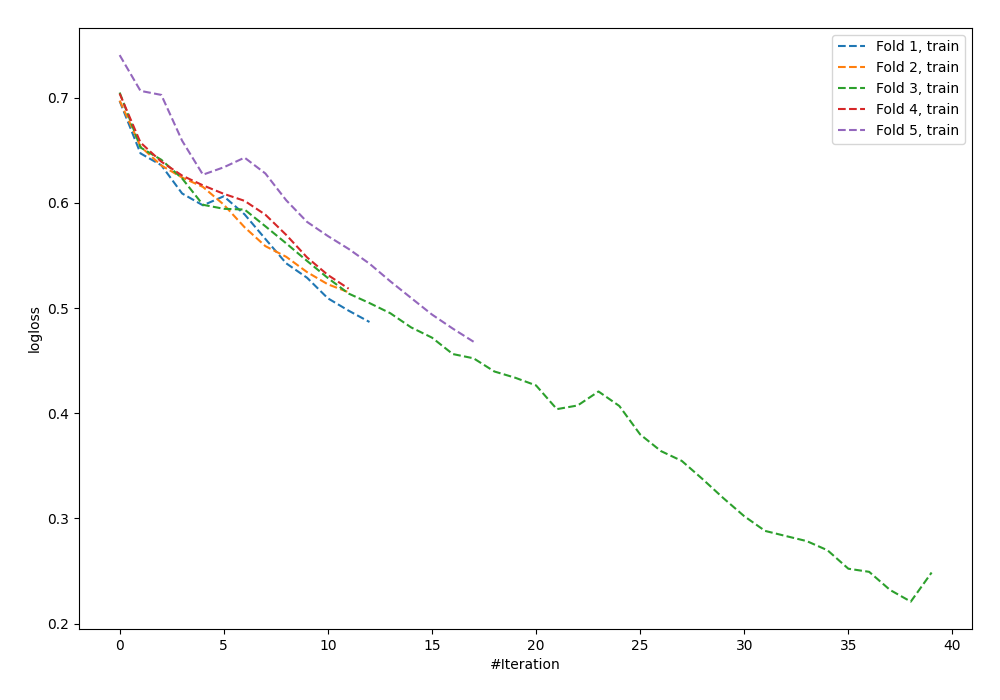

# Summary of 58_NeuralNetwork

[<< Go back](../README.md)

## Neural Network
- **n_jobs**: -1
- **dense_1_size**: 64
- **dense_2_size**: 16
- **learning_rate**: 0.01
- **explain_level**: 0

## Validation
 - **validation_type**: kfold
 - **shuffle**: True
 - **stratify**: True
 - **k_folds**: 5

## Optimized metric
logloss

## Training time

1.6 seconds

## Metric details
|           |    score |    threshold |
|:----------|---------:|-------------:|
| logloss   | 0.748438 | nan          |
| auc       | 0.558216 | nan          |
| f1        | 0.621253 |   0.33669    |
| accuracy  | 0.565495 |   0.448322   |
| precision | 0.571429 |   0.797216   |
| recall    | 1        |   0.00149978 |
| mcc       | 0.179448 |   0.33669    |

## Confusion matrix (at threshold=0.448322)
|                     |   Predicted as negative |   Predicted as positive |
|:--------------------|------------------------:|------------------------:|
| Labeled as negative |                     116 |                      57 |
| Labeled as positive |                      79 |                      61 |

## Learning curves

[<< Go back](../README.md)
