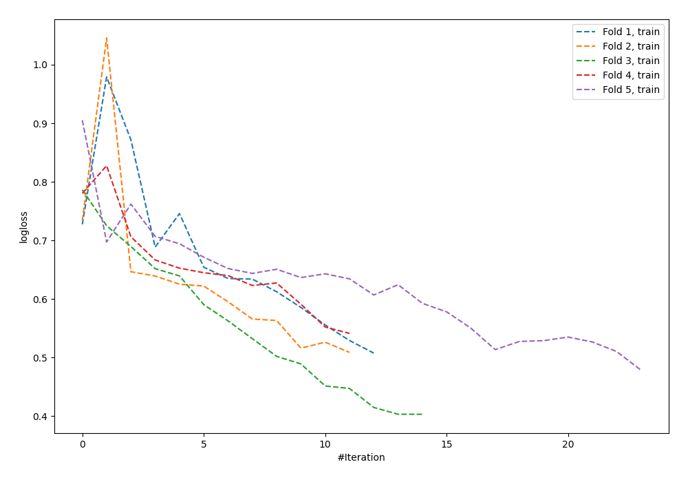

# Summary of 59_NeuralNetwork

[<< Go back](../README.md)

## Neural Network
- **n_jobs**: -1
- **dense_1_size**: 64
- **dense_2_size**: 32
- **learning_rate**: 0.08
- **explain_level**: 0

## Validation
 - **validation_type**: kfold
 - **shuffle**: True
 - **stratify**: True
 - **k_folds**: 5

## Optimized metric
logloss

## Training time

1.5 seconds

## Metric details
|           |    score |     threshold |
|:----------|---------:|--------------:|
| logloss   | 0.845317 | nan           |
| auc       | 0.520623 | nan           |
| f1        | 0.626126 |   0.0100895   |
| accuracy  | 0.549521 |   0.68135     |
| precision | 0.492188 |   0.450738    |
| recall    | 1        |   0.000901089 |
| mcc       | 0.116334 |   0.0100895   |

## Confusion matrix (at threshold=0.68135)
|                     |   Predicted as negative |   Predicted as positive |
|:--------------------|------------------------:|------------------------:|
| Labeled as negative |                     168 |                       5 |
| Labeled as positive |                     136 |                       4 |

## Learning curves

[<< Go back](../README.md)
