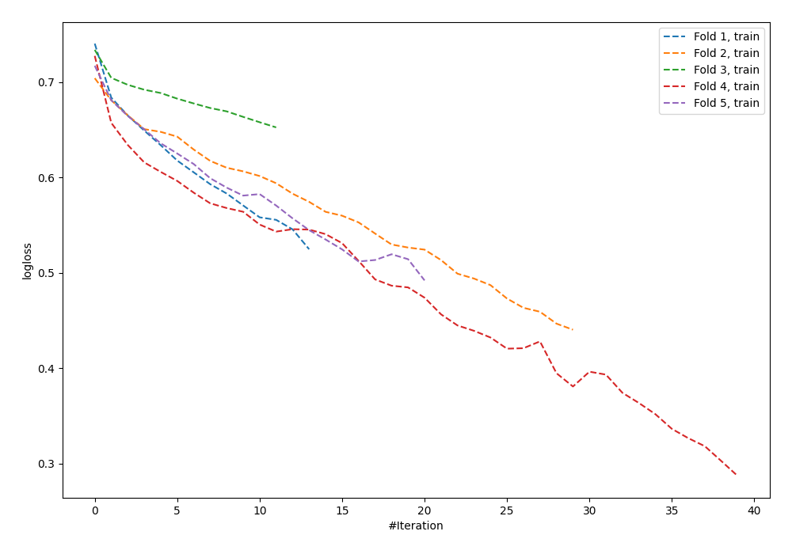

# Summary of 62_NeuralNetwork

[<< Go back](../README.md)

## Neural Network
- **n_jobs**: -1
- **dense_1_size**: 64
- **dense_2_size**: 4
- **learning_rate**: 0.01
- **explain_level**: 0

## Validation
 - **validation_type**: kfold
 - **shuffle**: True
 - **stratify**: True
 - **k_folds**: 5

## Optimized metric
logloss

## Training time

1.9 seconds

## Metric details
|           |    score |    threshold |
|:----------|---------:|-------------:|
| logloss   | 0.730031 | nan          |
| auc       | 0.579893 | nan          |
| f1        | 0.628702 |   0.12157    |
| accuracy  | 0.591054 |   0.507548   |
| precision | 0.6      |   0.73626    |
| recall    | 1        |   7.4203e-08 |
| mcc       | 0.160364 |   0.507548   |

## Confusion matrix (at threshold=0.507548)
|                     |   Predicted as negative |   Predicted as positive |
|:--------------------|------------------------:|------------------------:|
| Labeled as negative |                     122 |                      51 |
| Labeled as positive |                      77 |                      63 |

## Learning curves

[<< Go back](../README.md)
