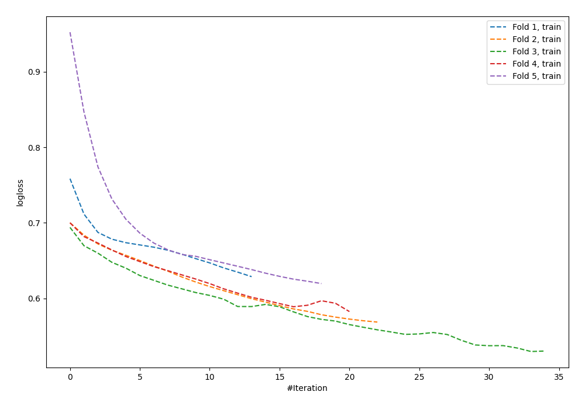

# Summary of 63_NeuralNetwork_SelectedFeatures

[<< Go back](../README.md)

## Neural Network
- **n_jobs**: -1
- **dense_1_size**: 16
- **dense_2_size**: 16
- **learning_rate**: 0.01
- **explain_level**: 0

## Validation
 - **validation_type**: kfold
 - **shuffle**: True
 - **stratify**: True
 - **k_folds**: 5

## Optimized metric
logloss

## Training time

1.2 seconds

## Metric details
|           |    score |    threshold |
|:----------|---------:|-------------:|
| logloss   | 0.684493 | nan          |
| auc       | 0.582329 | nan          |
| f1        | 0.631818 |   0.142712   |
| accuracy  | 0.58147  |   0.550539   |
| precision | 0.75     |   0.661183   |
| recall    | 1        |   0.00862155 |
| mcc       | 0.161625 |   0.4058     |

## Confusion matrix (at threshold=0.550539)
|                     |   Predicted as negative |   Predicted as positive |
|:--------------------|------------------------:|------------------------:|
| Labeled as negative |                     160 |                      13 |
| Labeled as positive |                     118 |                      22 |

## Learning curves

[<< Go back](../README.md)
