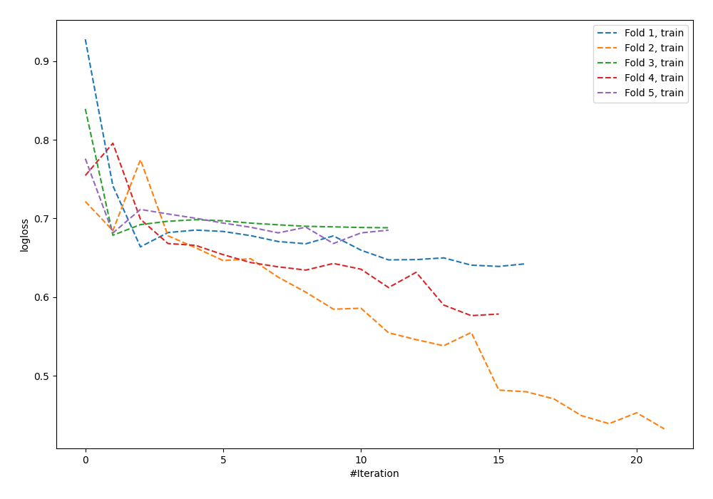

# Summary of 64_NeuralNetwork

[<< Go back](../README.md)

## Neural Network
- **n_jobs**: -1
- **dense_1_size**: 64
- **dense_2_size**: 8
- **learning_rate**: 0.1
- **explain_level**: 0

## Validation
 - **validation_type**: kfold
 - **shuffle**: True
 - **stratify**: True
 - **k_folds**: 5

## Optimized metric
logloss

## Training time

2.1 seconds

## Metric details
|           |     score |     threshold |
|:----------|----------:|--------------:|
| logloss   | 0.753589  | nan           |
| auc       | 0.534455  | nan           |
| f1        | 0.618102  |   0.000132268 |
| accuracy  | 0.56869   |   0.510235    |
| precision | 0.6       |   0.747129    |
| recall    | 1         |   0.000132268 |
| mcc       | 0.0887752 |   0.510235    |

## Confusion matrix (at threshold=0.510235)
|                     |   Predicted as negative |   Predicted as positive |
|:--------------------|------------------------:|------------------------:|
| Labeled as negative |                     155 |                      18 |
| Labeled as positive |                     117 |                      23 |

## Learning curves

[<< Go back](../README.md)
