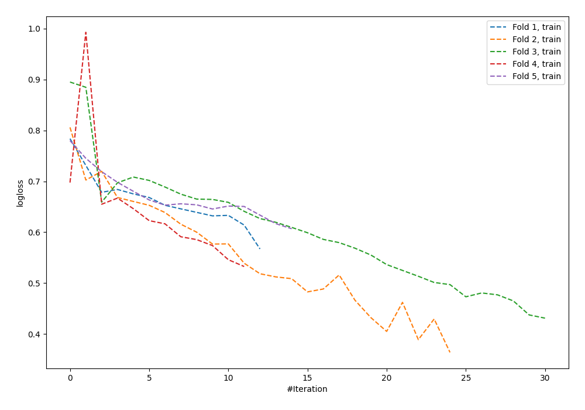

# Summary of 65_NeuralNetwork

[<< Go back](../README.md)

## Neural Network
- **n_jobs**: -1
- **dense_1_size**: 16
- **dense_2_size**: 32
- **learning_rate**: 0.08
- **explain_level**: 0

## Validation
 - **validation_type**: kfold
 - **shuffle**: True
 - **stratify**: True
 - **k_folds**: 5

## Optimized metric
logloss

## Training time

1.2 seconds

## Metric details
|           |    score |     threshold |
|:----------|---------:|--------------:|
| logloss   | 0.799786 | nan           |
| auc       | 0.578654 | nan           |
| f1        | 0.624719 |   0.0139956   |
| accuracy  | 0.597444 |   0.554225    |
| precision | 0.666667 |   0.710526    |
| recall    | 1        |   4.71491e-05 |
| mcc       | 0.165069 |   0.554225    |

## Confusion matrix (at threshold=0.554225)
|                     |   Predicted as negative |   Predicted as positive |
|:--------------------|------------------------:|------------------------:|
| Labeled as negative |                     147 |                      26 |
| Labeled as positive |                     100 |                      40 |

## Learning curves

[<< Go back](../README.md)
