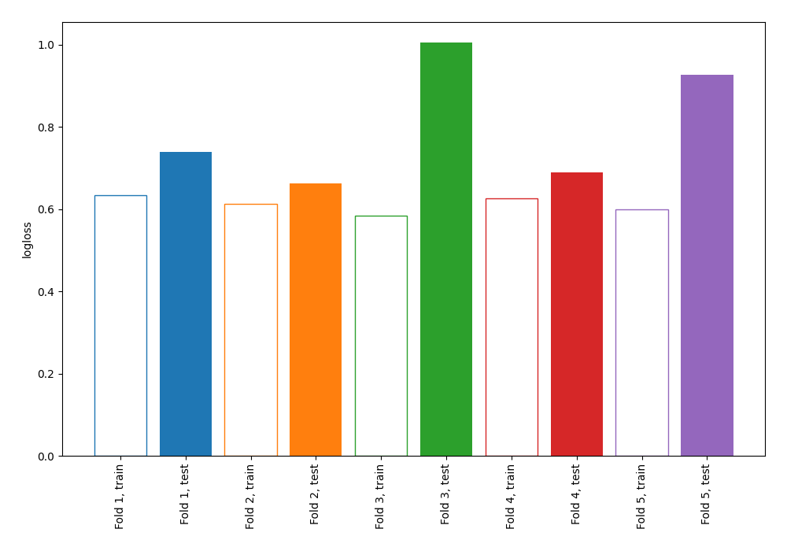

# Summary of 66_NearestNeighbors

[<< Go back](../README.md)

## k-Nearest Neighbors (Nearest Neighbors)
- **n_jobs**: -1
- **n_neighbors**: 7
- **weights**: uniform
- **explain_level**: 0

## Validation
 - **validation_type**: kfold
 - **shuffle**: True
 - **stratify**: True
 - **k_folds**: 5

## Optimized metric
logloss

## Training time

0.8 seconds

## Metric details
|           |    score |   threshold |
|:----------|---------:|------------:|
| logloss   | 0.805013 |  nan        |
| auc       | 0.519756 |  nan        |
| f1        | 0.616408 |    0        |
| accuracy  | 0.57508  |    0.785714 |
| precision | 0.888889 |    0.785714 |
| recall    | 0.992857 |    0        |
| mcc       | 0.152818 |    0.785714 |

## Confusion matrix (at threshold=0.785714)
|                     |   Predicted as negative |   Predicted as positive |
|:--------------------|------------------------:|------------------------:|
| Labeled as negative |                     172 |                       1 |
| Labeled as positive |                     132 |                       8 |

## Learning curves

[<< Go back](../README.md)
