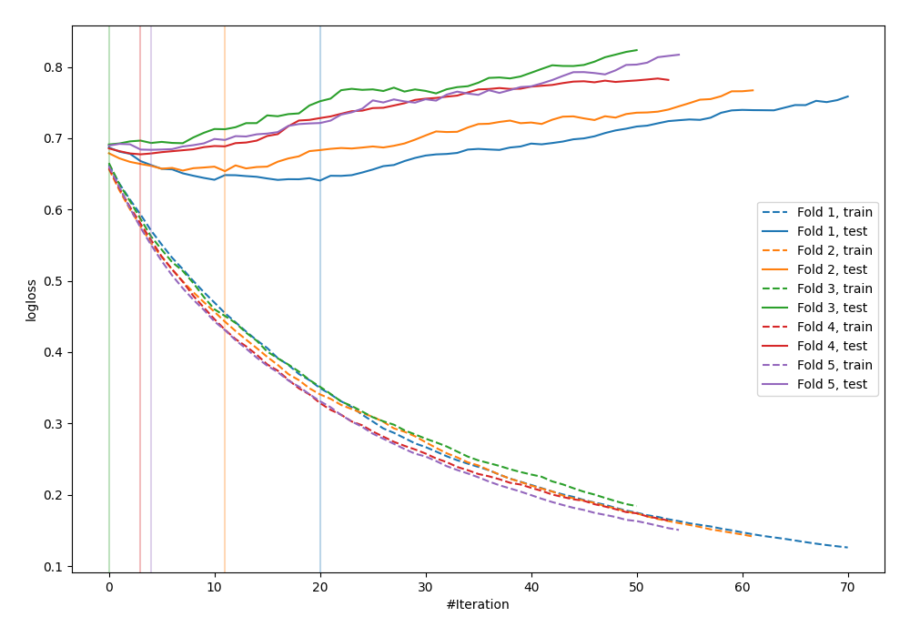

# Summary of 6_Default_Xgboost

[<< Go back](../README.md)

## Extreme Gradient Boosting (Xgboost)
- **n_jobs**: -1
- **objective**: binary:logistic
- **eval_metric**: logloss
- **eta**: 0.075
- **max_depth**: 6
- **min_child_weight**: 1
- **subsample**: 1.0
- **colsample_bytree**: 1.0
- **explain_level**: 0

## Validation
 - **validation_type**: kfold
 - **shuffle**: True
 - **stratify**: True
 - **k_folds**: 5

## Optimized metric
logloss

## Training time

1.7 seconds

## Metric details
|           |    score |   threshold |
|:----------|---------:|------------:|
| logloss   | 0.669294 |  nan        |
| auc       | 0.619034 |  nan        |
| f1        | 0.631325 |    0.358756 |
| accuracy  | 0.603834 |    0.495755 |
| precision | 0.636364 |    0.63235  |
| recall    | 1        |    0.112044 |
| mcc       | 0.201006 |    0.495755 |

## Confusion matrix (at threshold=0.495755)
|                     |   Predicted as negative |   Predicted as positive |
|:--------------------|------------------------:|------------------------:|
| Labeled as negative |                     109 |                      64 |
| Labeled as positive |                      60 |                      80 |

## Learning curves

[<< Go back](../README.md)
