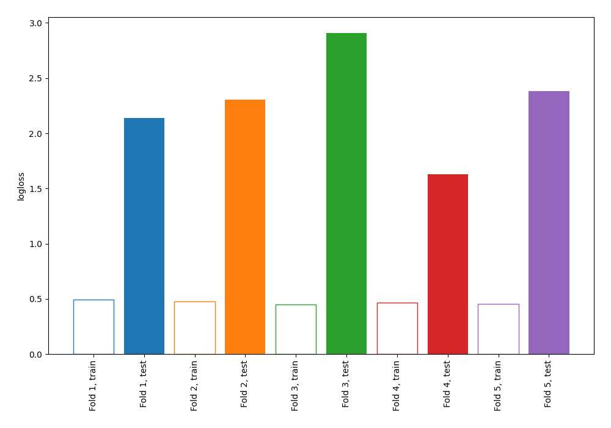

# Summary of 70_NearestNeighbors

[<< Go back](../README.md)

## k-Nearest Neighbors (Nearest Neighbors)
- **n_jobs**: -1
- **n_neighbors**: 3
- **weights**: uniform
- **explain_level**: 0

## Validation
 - **validation_type**: kfold
 - **shuffle**: True
 - **stratify**: True
 - **k_folds**: 5

## Optimized metric
logloss

## Training time

0.8 seconds

## Metric details
|           |    score |   threshold |
|:----------|---------:|------------:|
| logloss   | 2.27279  |  nan        |
| auc       | 0.507659 |  nan        |
| f1        | 0.578313 |    0        |
| accuracy  | 0.539936 |    0.666667 |
| precision | 0.47482  |    0.5      |
| recall    | 0.857143 |    0        |
| mcc       | 0.049498 |    0.5      |

## Confusion matrix (at threshold=0.666667)
|                     |   Predicted as negative |   Predicted as positive |
|:--------------------|------------------------:|------------------------:|
| Labeled as negative |                     154 |                      19 |
| Labeled as positive |                     125 |                      15 |

## Learning curves

[<< Go back](../README.md)
