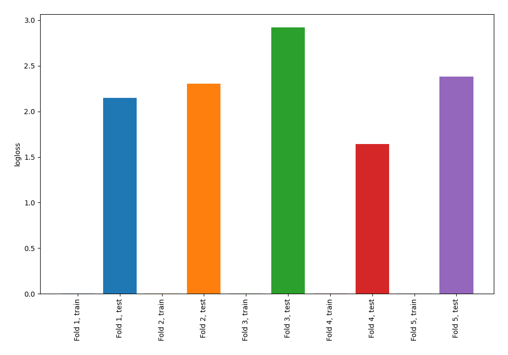

# Summary of 72_NearestNeighbors

[<< Go back](../README.md)

## k-Nearest Neighbors (Nearest Neighbors)
- **n_jobs**: -1
- **n_neighbors**: 3
- **weights**: distance
- **explain_level**: 0

## Validation
 - **validation_type**: kfold
 - **shuffle**: True
 - **stratify**: True
 - **k_folds**: 5

## Optimized metric
logloss

## Training time

1.0 seconds

## Metric details
|           |     score |   threshold |
|:----------|----------:|------------:|
| logloss   | 2.28034   |  nan        |
| auc       | 0.496718  |  nan        |
| f1        | 0.578313  |    0        |
| accuracy  | 0.543131  |    0.812096 |
| precision | 0.475524  |    0.401604 |
| recall    | 0.857143  |    0        |
| mcc       | 0.0520916 |    0.401604 |

## Confusion matrix (at threshold=0.812096)
|                     |   Predicted as negative |   Predicted as positive |
|:--------------------|------------------------:|------------------------:|
| Labeled as negative |                     154 |                      19 |
| Labeled as positive |                     124 |                      16 |

## Learning curves

[<< Go back](../README.md)
