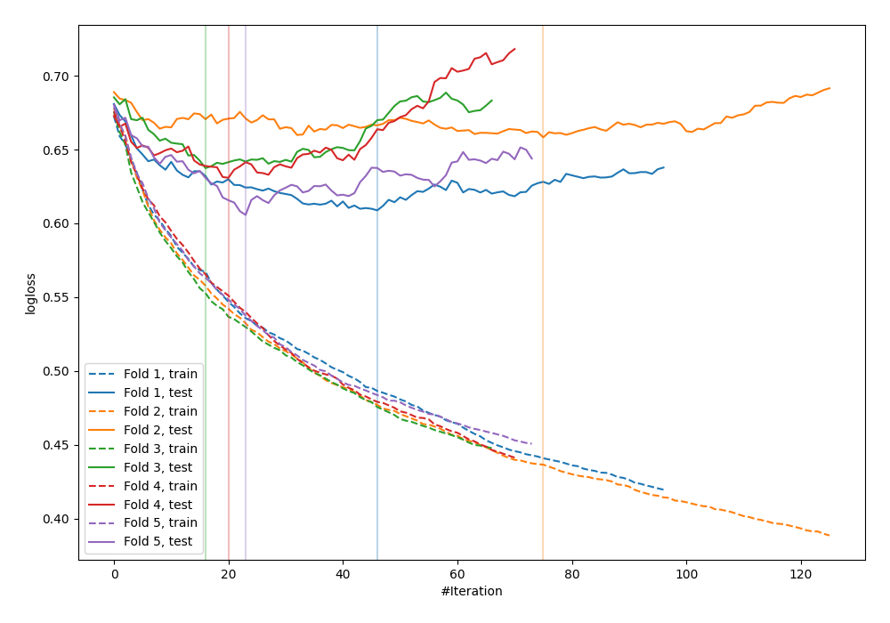

# Summary of 73_Xgboost_SelectedFeatures

[<< Go back](../README.md)

## Extreme Gradient Boosting (Xgboost)
- **n_jobs**: -1
- **objective**: binary:logistic
- **eval_metric**: logloss
- **eta**: 0.1
- **max_depth**: 6
- **min_child_weight**: 5
- **subsample**: 0.6
- **colsample_bytree**: 0.8
- **explain_level**: 0

## Validation
 - **validation_type**: kfold
 - **shuffle**: True
 - **stratify**: True
 - **k_folds**: 5

## Optimized metric
logloss

## Training time

2.2 seconds

## Metric details
|           |    score |   threshold |
|:----------|---------:|------------:|
| logloss   | 0.628289 | nan         |
| auc       | 0.695541 | nan         |
| f1        | 0.656977 |   0.37335   |
| accuracy  | 0.658147 |   0.501005  |
| precision | 0.787879 |   0.68995   |
| recall    | 1        |   0.0684239 |
| mcc       | 0.30422  |   0.426527  |

## Confusion matrix (at threshold=0.501005)
|                     |   Predicted as negative |   Predicted as positive |
|:--------------------|------------------------:|------------------------:|
| Labeled as negative |                     127 |                      46 |
| Labeled as positive |                      61 |                      79 |

## Learning curves

[<< Go back](../README.md)
