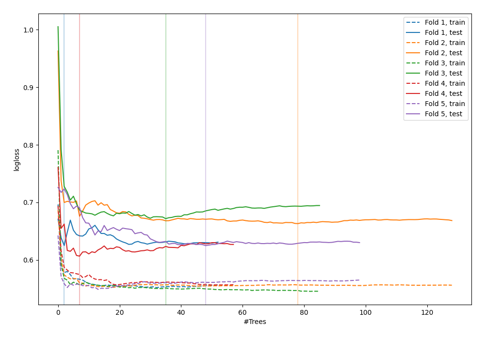

# Summary of 74_RandomForest_GoldenFeatures

[<< Go back](../README.md)

## Random Forest
- **n_jobs**: -1
- **criterion**: gini
- **max_features**: 0.6
- **min_samples_split**: 50
- **max_depth**: 3
- **explain_level**: 0

## Validation
 - **validation_type**: kfold
 - **shuffle**: True
 - **stratify**: True
 - **k_folds**: 5

## Optimized metric
logloss

## Training time

5.2 seconds

## Metric details
|           |    score |   threshold |
|:----------|---------:|------------:|
| logloss   | 0.638509 |  nan        |
| auc       | 0.672729 |  nan        |
| f1        | 0.664935 |    0.296657 |
| accuracy  | 0.654952 |    0.457199 |
| precision | 1        |    0.709303 |
| recall    | 1        |    0.125764 |
| mcc       | 0.325831 |    0.44906  |

## Confusion matrix (at threshold=0.457199)
|                     |   Predicted as negative |   Predicted as positive |
|:--------------------|------------------------:|------------------------:|
| Labeled as negative |                     102 |                      71 |
| Labeled as positive |                      37 |                     103 |

## Learning curves

[<< Go back](../README.md)
