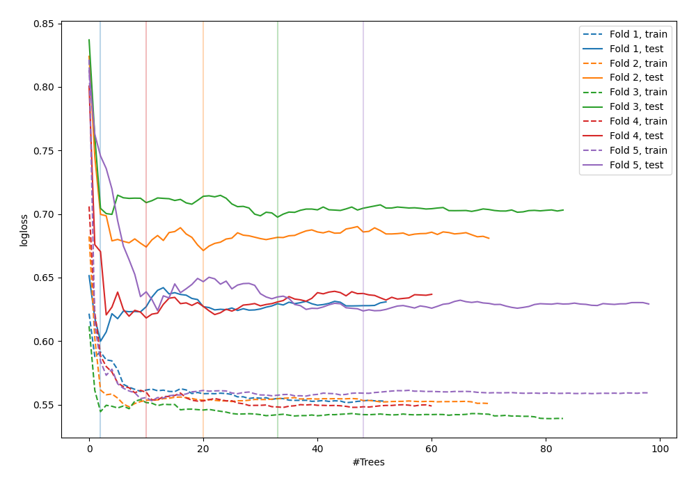

# Summary of 75_RandomForest_GoldenFeatures

[<< Go back](../README.md)

## Random Forest
- **n_jobs**: -1
- **criterion**: gini
- **max_features**: 0.8
- **min_samples_split**: 50
- **max_depth**: 3
- **explain_level**: 0

## Validation
 - **validation_type**: kfold
 - **shuffle**: True
 - **stratify**: True
 - **k_folds**: 5

## Optimized metric
logloss

## Training time

4.2 seconds

## Metric details
|           |    score |   threshold |
|:----------|---------:|------------:|
| logloss   | 0.642252 |  nan        |
| auc       | 0.66699  |  nan        |
| f1        | 0.657754 |    0.332563 |
| accuracy  | 0.635783 |    0.496856 |
| precision | 0.714286 |    0.672042 |
| recall    | 1        |    0.126294 |
| mcc       | 0.279839 |    0.414435 |

## Confusion matrix (at threshold=0.496856)
|                     |   Predicted as negative |   Predicted as positive |
|:--------------------|------------------------:|------------------------:|
| Labeled as negative |                     114 |                      59 |
| Labeled as positive |                      55 |                      85 |

## Learning curves

[<< Go back](../README.md)
