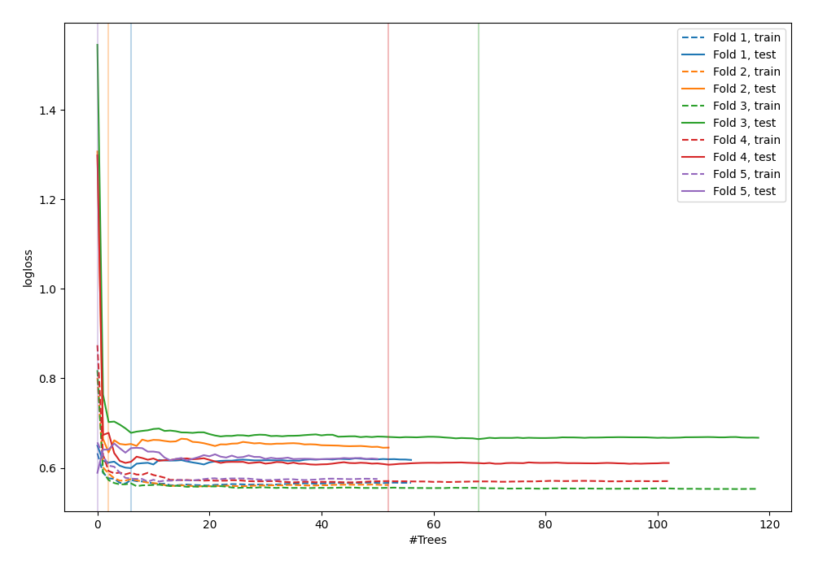

# Summary of 76_RandomForest_GoldenFeatures_SelectedFeatures

[<< Go back](../README.md)

## Random Forest
- **n_jobs**: -1
- **criterion**: gini
- **max_features**: 0.6
- **min_samples_split**: 50
- **max_depth**: 3
- **explain_level**: 0

## Validation
 - **validation_type**: kfold
 - **shuffle**: True
 - **stratify**: True
 - **k_folds**: 5

## Optimized metric
logloss

## Training time

4.9 seconds

## Metric details
|           |    score |   threshold |
|:----------|---------:|------------:|
| logloss   | 0.618965 |  nan        |
| auc       | 0.700351 |  nan        |
| f1        | 0.692098 |    0.321563 |
| accuracy  | 0.658147 |    0.515216 |
| precision | 0.7      |    0.676471 |
| recall    | 1        |    0.075    |
| mcc       | 0.366576 |    0.321563 |

## Confusion matrix (at threshold=0.515216)
|                     |   Predicted as negative |   Predicted as positive |
|:--------------------|------------------------:|------------------------:|
| Labeled as negative |                     113 |                      60 |
| Labeled as positive |                      47 |                      93 |

## Learning curves

[<< Go back](../README.md)
