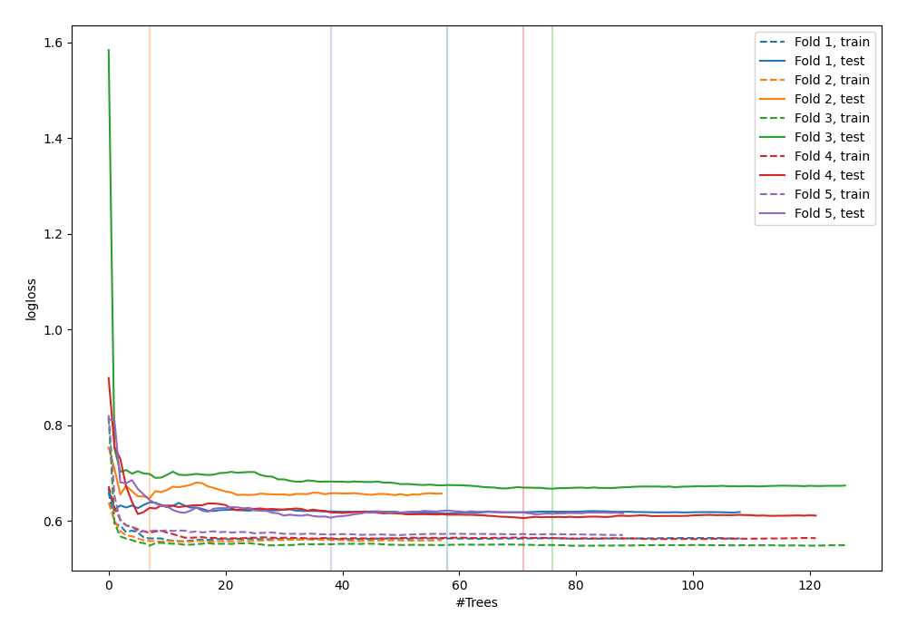

# Summary of 77_RandomForest_GoldenFeatures_SelectedFeatures

[<< Go back](../README.md)

## Random Forest
- **n_jobs**: -1
- **criterion**: gini
- **max_features**: 0.8
- **min_samples_split**: 50
- **max_depth**: 3
- **explain_level**: 0

## Validation
 - **validation_type**: kfold
 - **shuffle**: True
 - **stratify**: True
 - **k_folds**: 5

## Optimized metric
logloss

## Training time

6.1 seconds

## Metric details
|           |    score |   threshold |
|:----------|---------:|------------:|
| logloss   | 0.629132 |  nan        |
| auc       | 0.687903 |  nan        |
| f1        | 0.666667 |    0.278407 |
| accuracy  | 0.674121 |    0.492771 |
| precision | 0.666667 |    0.597543 |
| recall    | 1        |    0.105717 |
| mcc       | 0.34729  |    0.492771 |

## Confusion matrix (at threshold=0.492771)
|                     |   Predicted as negative |   Predicted as positive |
|:--------------------|------------------------:|------------------------:|
| Labeled as negative |                     116 |                      57 |
| Labeled as positive |                      45 |                      95 |

## Learning curves

[<< Go back](../README.md)
