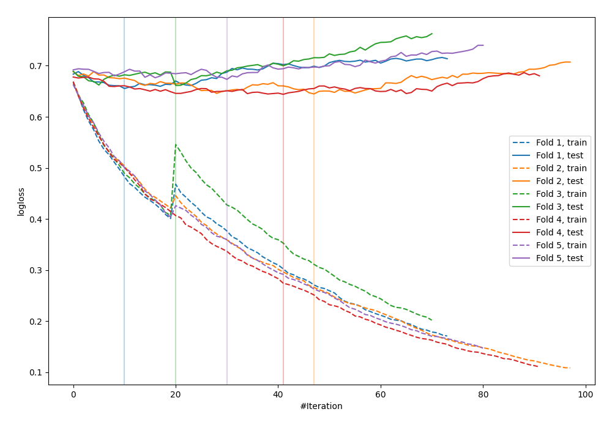

# Summary of 7_Default_CatBoost

[<< Go back](../README.md)

## CatBoost
- **n_jobs**: -1
- **learning_rate**: 0.1
- **depth**: 6
- **rsm**: 1
- **loss_function**: Logloss
- **explain_level**: 0

## Validation
 - **validation_type**: kfold
 - **shuffle**: True
 - **stratify**: True
 - **k_folds**: 5

## Optimized metric
logloss

## Training time

3.0 seconds

## Metric details
|           |    score |   threshold |
|:----------|---------:|------------:|
| logloss   | 0.656896 | nan         |
| auc       | 0.639059 | nan         |
| f1        | 0.630332 |   0.245917  |
| accuracy  | 0.623003 |   0.514359  |
| precision | 0.733333 |   0.718968  |
| recall    | 1        |   0.0505605 |
| mcc       | 0.226094 |   0.514359  |

## Confusion matrix (at threshold=0.514359)
|                     |   Predicted as negative |   Predicted as positive |
|:--------------------|------------------------:|------------------------:|
| Labeled as negative |                     129 |                      44 |
| Labeled as positive |                      74 |                      66 |

## Learning curves

[<< Go back](../README.md)
