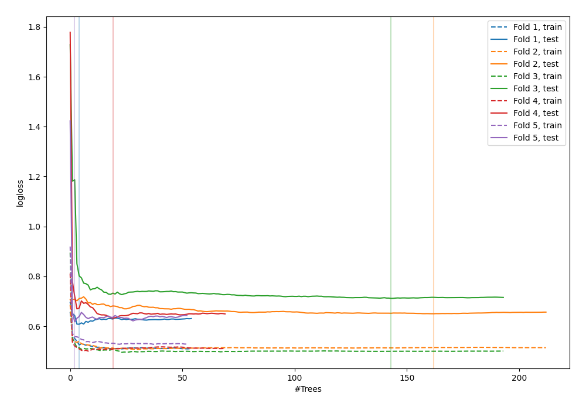

# Summary of 80_RandomForest

[<< Go back](../README.md)

## Random Forest
- **n_jobs**: -1
- **criterion**: entropy
- **max_features**: 0.5
- **min_samples_split**: 50
- **max_depth**: 6
- **explain_level**: 0

## Validation
 - **validation_type**: kfold
 - **shuffle**: True
 - **stratify**: True
 - **k_folds**: 5

## Optimized metric
logloss

## Training time

6.8 seconds

## Metric details
|           |    score |   threshold |
|:----------|---------:|------------:|
| logloss   | 0.644287 | nan         |
| auc       | 0.664492 | nan         |
| f1        | 0.671679 |   0.220894  |
| accuracy  | 0.629393 |   0.52417   |
| precision | 0.75     |   0.692723  |
| recall    | 1        |   0.0422826 |
| mcc       | 0.308722 |   0.220894  |

## Confusion matrix (at threshold=0.52417)
|                     |   Predicted as negative |   Predicted as positive |
|:--------------------|------------------------:|------------------------:|
| Labeled as negative |                     121 |                      52 |
| Labeled as positive |                      64 |                      76 |

## Learning curves

[<< Go back](../README.md)
