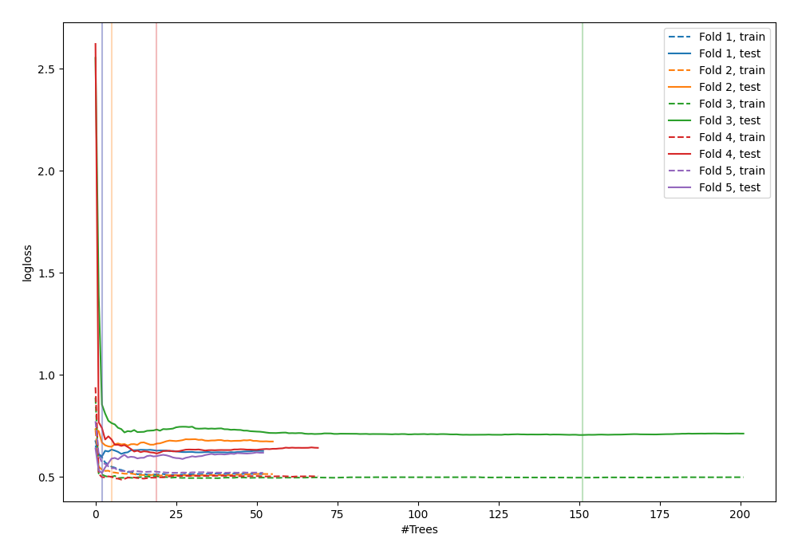

# Summary of 81_RandomForest

[<< Go back](../README.md)

## Random Forest
- **n_jobs**: -1
- **criterion**: entropy
- **max_features**: 0.7
- **min_samples_split**: 50
- **max_depth**: 6
- **explain_level**: 0

## Validation
 - **validation_type**: kfold
 - **shuffle**: True
 - **stratify**: True
 - **k_folds**: 5

## Optimized metric
logloss

## Training time

5.6 seconds

## Metric details
|           |    score |   threshold |
|:----------|---------:|------------:|
| logloss   | 0.618504 | nan         |
| auc       | 0.704955 | nan         |
| f1        | 0.670103 |   0.228168  |
| accuracy  | 0.664537 |   0.434362  |
| precision | 0.894737 |   0.70182   |
| recall    | 1        |   0.0663616 |
| mcc       | 0.340474 |   0.428011  |

## Confusion matrix (at threshold=0.434362)
|                     |   Predicted as negative |   Predicted as positive |
|:--------------------|------------------------:|------------------------:|
| Labeled as negative |                     107 |                      66 |
| Labeled as positive |                      39 |                     101 |

## Learning curves

[<< Go back](../README.md)
