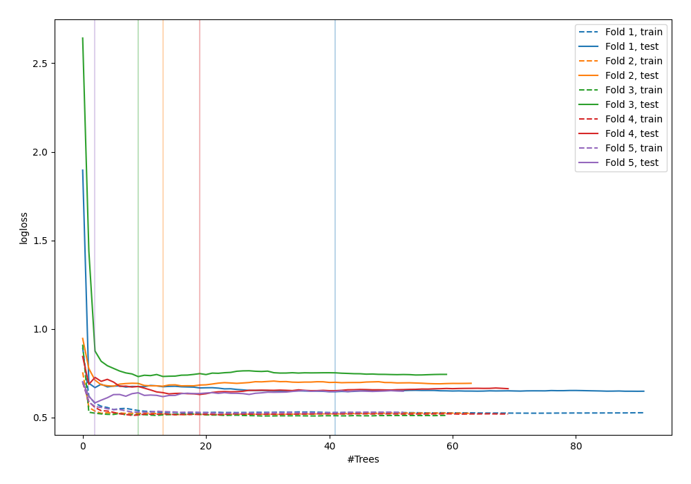

# Summary of 81_RandomForest_BoostOnErrors

[<< Go back](../README.md)

## Random Forest
- **n_jobs**: -1
- **criterion**: entropy
- **max_features**: 0.7
- **min_samples_split**: 50
- **max_depth**: 6
- **explain_level**: 0

## Validation
 - **validation_type**: kfold
 - **shuffle**: True
 - **stratify**: True
 - **k_folds**: 5

## Optimized metric
logloss

## Training time

4.5 seconds

## Metric details
|           |    score |   threshold |
|:----------|---------:|------------:|
| logloss   | 0.63749  | nan         |
| auc       | 0.675599 | nan         |
| f1        | 0.661333 |   0.316208  |
| accuracy  | 0.654952 |   0.475737  |
| precision | 0.785714 |   0.70379   |
| recall    | 1        |   0.0357326 |
| mcc       | 0.30872  |   0.475737  |

## Confusion matrix (at threshold=0.475737)
|                     |   Predicted as negative |   Predicted as positive |
|:--------------------|------------------------:|------------------------:|
| Labeled as negative |                     113 |                      60 |
| Labeled as positive |                      48 |                      92 |

## Learning curves

[<< Go back](../README.md)
