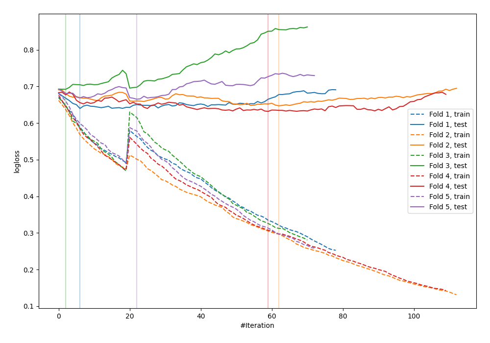

# Summary of 82_CatBoost

[<< Go back](../README.md)

## CatBoost
- **n_jobs**: -1
- **learning_rate**: 0.1
- **depth**: 5
- **rsm**: 0.7
- **loss_function**: Logloss
- **explain_level**: 0

## Validation
 - **validation_type**: kfold
 - **shuffle**: True
 - **stratify**: True
 - **k_folds**: 5

## Optimized metric
logloss

## Training time

2.1 seconds

## Metric details
|           |    score |   threshold |
|:----------|---------:|------------:|
| logloss   | 0.656109 |  nan        |
| auc       | 0.64038  |  nan        |
| f1        | 0.645477 |    0.311112 |
| accuracy  | 0.626198 |    0.535489 |
| precision | 0.705882 |    0.605321 |
| recall    | 1        |    0.077995 |
| mcc       | 0.230877 |    0.535489 |

## Confusion matrix (at threshold=0.535489)
|                     |   Predicted as negative |   Predicted as positive |
|:--------------------|------------------------:|------------------------:|
| Labeled as negative |                     142 |                      31 |
| Labeled as positive |                      86 |                      54 |

## Learning curves

[<< Go back](../README.md)
