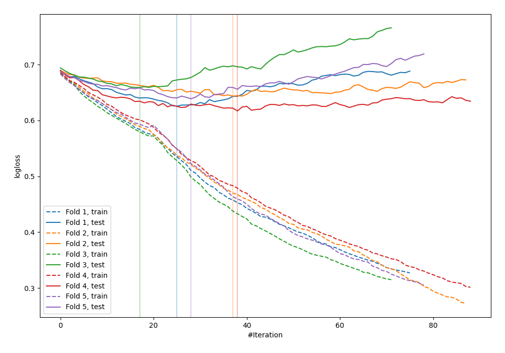

# Summary of 83_CatBoost_SelectedFeatures

[<< Go back](../README.md)

## CatBoost
- **n_jobs**: -1
- **learning_rate**: 0.1
- **depth**: 5
- **rsm**: 0.7
- **loss_function**: Logloss
- **explain_level**: 0

## Validation
 - **validation_type**: kfold
 - **shuffle**: True
 - **stratify**: True
 - **k_folds**: 5

## Optimized metric
logloss

## Training time

1.6 seconds

## Metric details
|           |    score |   threshold |
|:----------|---------:|------------:|
| logloss   | 0.637168 | nan         |
| auc       | 0.680718 | nan         |
| f1        | 0.656    |   0.333955  |
| accuracy  | 0.658147 |   0.538468  |
| precision | 0.777778 |   0.660682  |
| recall    | 1        |   0.0961904 |
| mcc       | 0.300436 |   0.538468  |

## Confusion matrix (at threshold=0.538468)
|                     |   Predicted as negative |   Predicted as positive |
|:--------------------|------------------------:|------------------------:|
| Labeled as negative |                     133 |                      40 |
| Labeled as positive |                      67 |                      73 |

## Learning curves

[<< Go back](../README.md)
