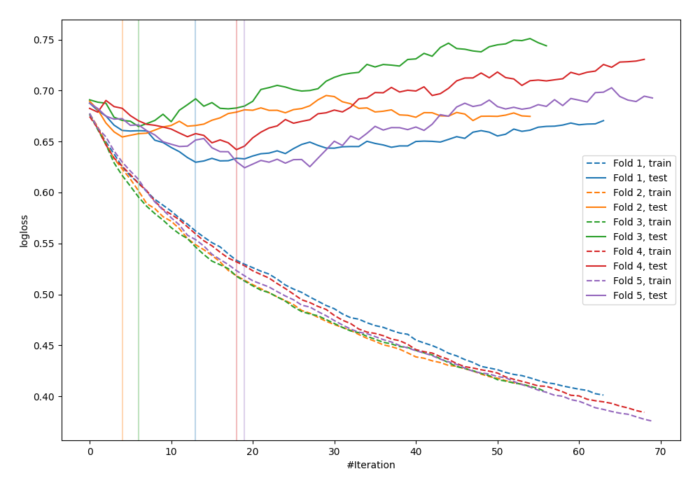

# Summary of 84_Xgboost

[<< Go back](../README.md)

## Extreme Gradient Boosting (Xgboost)
- **n_jobs**: -1
- **objective**: binary:logistic
- **eval_metric**: logloss
- **eta**: 0.1
- **max_depth**: 6
- **min_child_weight**: 5
- **subsample**: 0.6
- **colsample_bytree**: 0.8
- **explain_level**: 0

## Validation
 - **validation_type**: kfold
 - **shuffle**: True
 - **stratify**: True
 - **k_folds**: 5

## Optimized metric
logloss

## Training time

1.6 seconds

## Metric details
|           |    score |   threshold |
|:----------|---------:|------------:|
| logloss   | 0.643081 |  nan        |
| auc       | 0.676693 |  nan        |
| f1        | 0.643312 |    0.468071 |
| accuracy  | 0.648562 |    0.50543  |
| precision | 1        |    0.725523 |
| recall    | 1        |    0.140262 |
| mcc       | 0.299674 |    0.468071 |

## Confusion matrix (at threshold=0.50543)
|                     |   Predicted as negative |   Predicted as positive |
|:--------------------|------------------------:|------------------------:|
| Labeled as negative |                     120 |                      53 |
| Labeled as positive |                      57 |                      83 |

## Learning curves

[<< Go back](../README.md)
