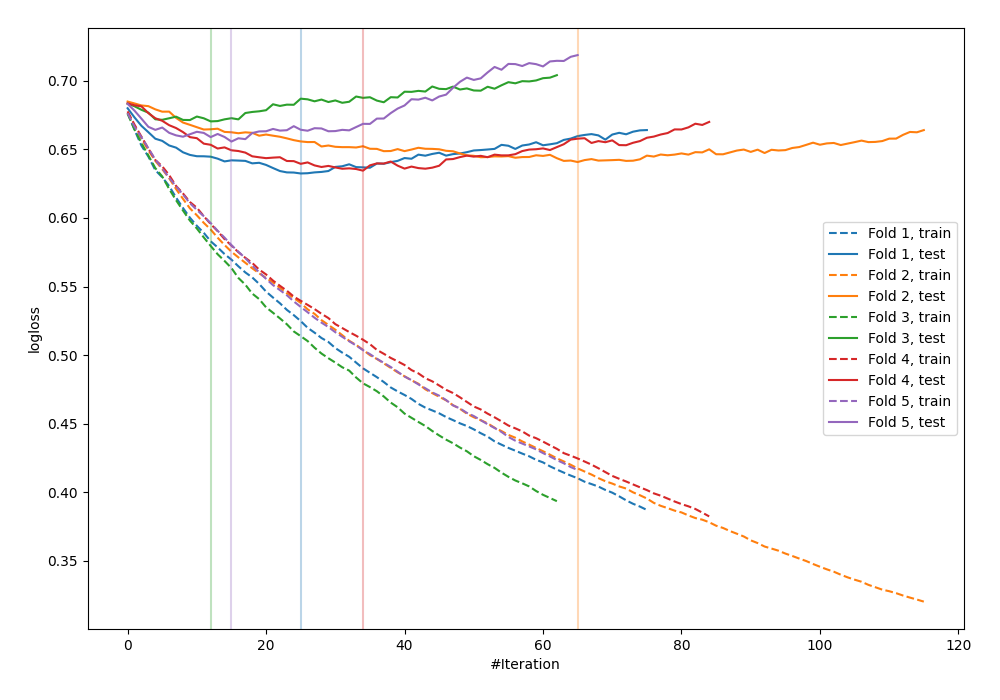

# Summary of 86_LightGBM

[<< Go back](../README.md)

## LightGBM
- **n_jobs**: -1
- **objective**: binary
- **metric**: binary_logloss
- **num_leaves**: 63
- **learning_rate**: 0.05
- **feature_fraction**: 0.9
- **bagging_fraction**: 0.5
- **min_data_in_leaf**: 30
- **explain_level**: 0

## Validation
 - **validation_type**: kfold
 - **shuffle**: True
 - **stratify**: True
 - **k_folds**: 5

## Optimized metric
logloss

## Training time

1.2 seconds

## Metric details
|           |    score |   threshold |
|:----------|---------:|------------:|
| logloss   | 0.6468   | nan         |
| auc       | 0.652746 | nan         |
| f1        | 0.654731 |   0.316607  |
| accuracy  | 0.626198 |   0.404691  |
| precision | 1        |   0.714603  |
| recall    | 1        |   0.0701895 |
| mcc       | 0.286437 |   0.401607  |

## Confusion matrix (at threshold=0.404691)
|                     |   Predicted as negative |   Predicted as positive |
|:--------------------|------------------------:|------------------------:|
| Labeled as negative |                      90 |                      83 |
| Labeled as positive |                      34 |                     106 |

## Learning curves

[<< Go back](../README.md)
