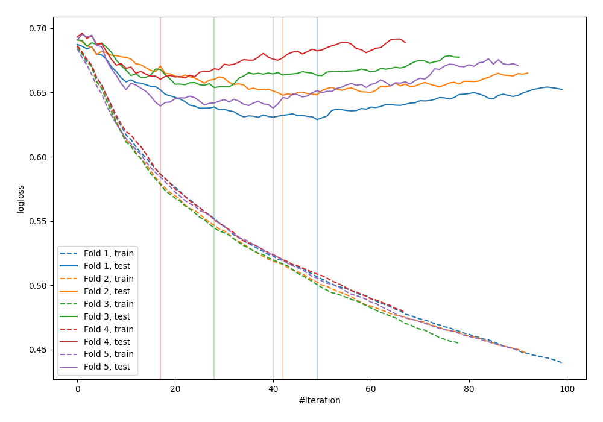

# Summary of 89_Xgboost

[<< Go back](../README.md)

## Extreme Gradient Boosting (Xgboost)
- **n_jobs**: -1
- **objective**: binary:logistic
- **eval_metric**: logloss
- **eta**: 0.075
- **max_depth**: 8
- **min_child_weight**: 10
- **subsample**: 0.9
- **colsample_bytree**: 0.7
- **explain_level**: 0

## Validation
 - **validation_type**: kfold
 - **shuffle**: True
 - **stratify**: True
 - **k_folds**: 5

## Optimized metric
logloss

## Training time

1.4 seconds

## Metric details
|           |    score |   threshold |
|:----------|---------:|------------:|
| logloss   | 0.645741 |  nan        |
| auc       | 0.66668  |  nan        |
| f1        | 0.649485 |    0.311571 |
| accuracy  | 0.638978 |    0.457538 |
| precision | 0.677419 |    0.621715 |
| recall    | 1        |    0.121999 |
| mcc       | 0.275958 |    0.457538 |

## Confusion matrix (at threshold=0.457538)
|                     |   Predicted as negative |   Predicted as positive |
|:--------------------|------------------------:|------------------------:|
| Labeled as negative |                     111 |                      62 |
| Labeled as positive |                      51 |                      89 |

## Learning curves

[<< Go back](../README.md)
