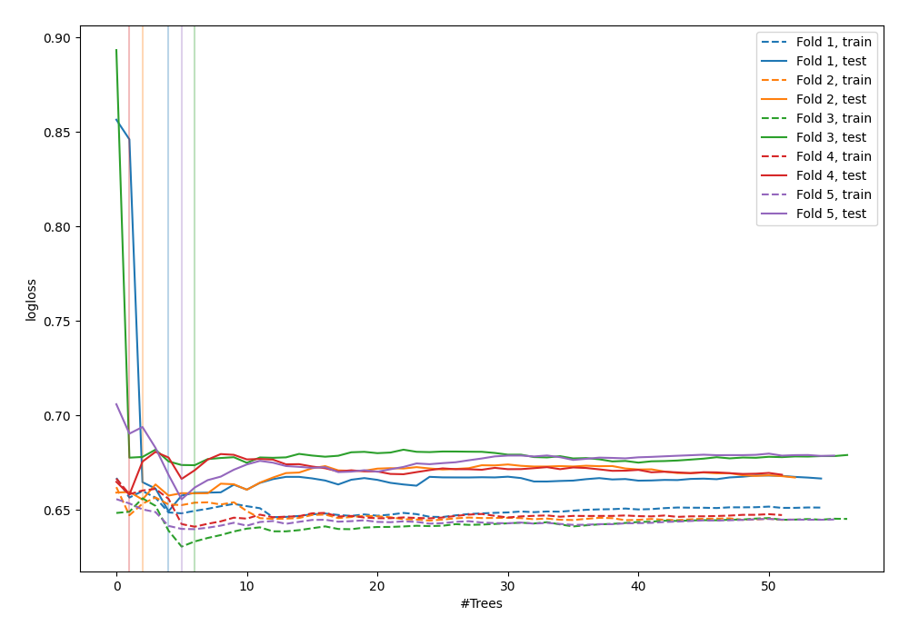

# Summary of 90_ExtraTrees_SelectedFeatures

[<< Go back](../README.md)

## Extra Trees Classifier (Extra Trees)
- **n_jobs**: -1
- **criterion**: gini
- **max_features**: 0.6
- **min_samples_split**: 50
- **max_depth**: 3
- **explain_level**: 0

## Validation
 - **validation_type**: kfold
 - **shuffle**: True
 - **stratify**: True
 - **k_folds**: 5

## Optimized metric
logloss

## Training time

3.4 seconds

## Metric details
|           |    score |   threshold |
|:----------|---------:|------------:|
| logloss   | 0.658496 |  nan        |
| auc       | 0.656957 |  nan        |
| f1        | 0.654321 |    0.440053 |
| accuracy  | 0.648562 |    0.446743 |
| precision | 0.8      |    0.555515 |
| recall    | 1        |    0.127905 |
| mcc       | 0.310819 |    0.446743 |

## Confusion matrix (at threshold=0.446743)
|                     |   Predicted as negative |   Predicted as positive |
|:--------------------|------------------------:|------------------------:|
| Labeled as negative |                     102 |                      71 |
| Labeled as positive |                      39 |                     101 |

## Learning curves

[<< Go back](../README.md)
