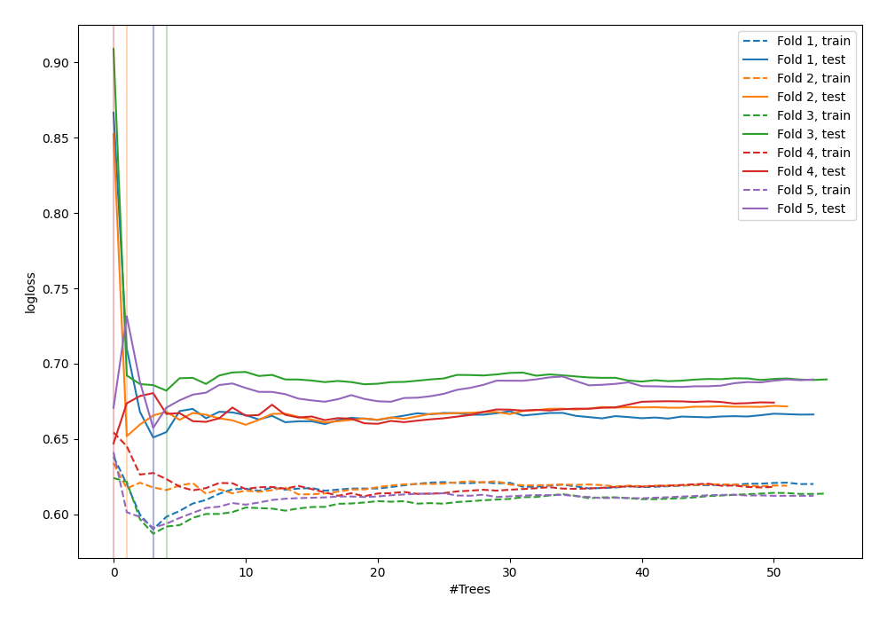

# Summary of 93_ExtraTrees

[<< Go back](../README.md)

## Extra Trees Classifier (Extra Trees)
- **n_jobs**: -1
- **criterion**: gini
- **max_features**: 0.8
- **min_samples_split**: 50
- **max_depth**: 3
- **explain_level**: 0

## Validation
 - **validation_type**: kfold
 - **shuffle**: True
 - **stratify**: True
 - **k_folds**: 5

## Optimized metric
logloss

## Training time

3.4 seconds

## Metric details
|           |    score |   threshold |
|:----------|---------:|------------:|
| logloss   | 0.657874 |  nan        |
| auc       | 0.633774 |  nan        |
| f1        | 0.647754 |    0.307566 |
| accuracy  | 0.619808 |    0.521321 |
| precision | 0.648649 |    0.604944 |
| recall    | 1        |    0.128571 |
| mcc       | 0.22741  |    0.307566 |

## Confusion matrix (at threshold=0.521321)
|                     |   Predicted as negative |   Predicted as positive |
|:--------------------|------------------------:|------------------------:|
| Labeled as negative |                     138 |                      35 |
| Labeled as positive |                      84 |                      56 |

## Learning curves

[<< Go back](../README.md)
