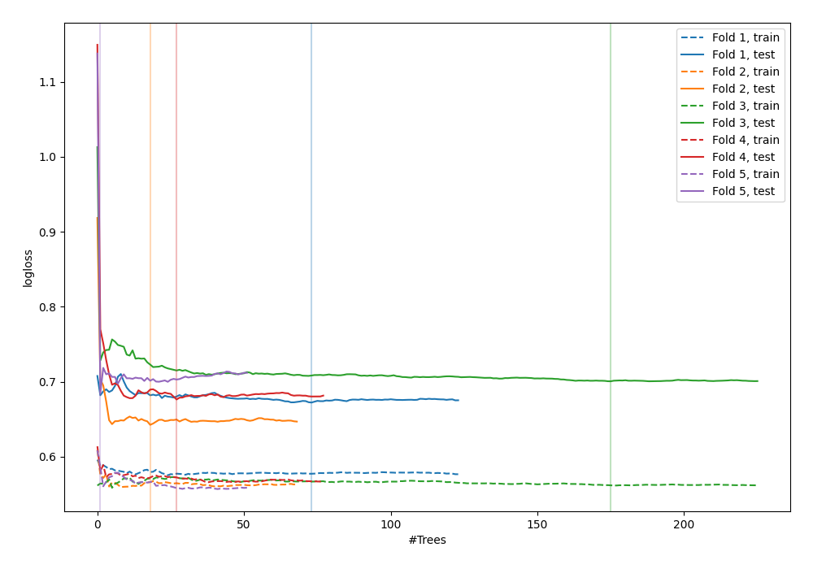

# Summary of 94_ExtraTrees

[<< Go back](../README.md)

## Extra Trees Classifier (Extra Trees)
- **n_jobs**: -1
- **criterion**: gini
- **max_features**: 0.8
- **min_samples_split**: 40
- **max_depth**: 5
- **explain_level**: 0

## Validation
 - **validation_type**: kfold
 - **shuffle**: True
 - **stratify**: True
 - **k_folds**: 5

## Optimized metric
logloss

## Training time

5.8 seconds

## Metric details
|           |    score |   threshold |
|:----------|---------:|------------:|
| logloss   | 0.675325 |  nan        |
| auc       | 0.586499 |  nan        |
| f1        | 0.619718 |    0.290652 |
| accuracy  | 0.603834 |    0.567183 |
| precision | 0.772727 |    0.582678 |
| recall    | 1        |    0.180882 |
| mcc       | 0.199344 |    0.567183 |

## Confusion matrix (at threshold=0.567183)
|                     |   Predicted as negative |   Predicted as positive |
|:--------------------|------------------------:|------------------------:|
| Labeled as negative |                     163 |                      10 |
| Labeled as positive |                     114 |                      26 |

## Learning curves

[<< Go back](../README.md)
