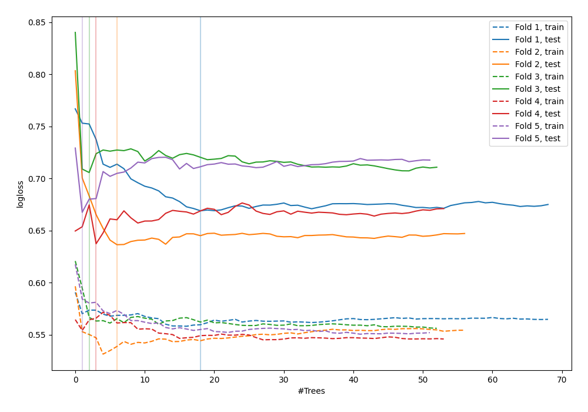

# Summary of 95_ExtraTrees

[<< Go back](../README.md)

## Extra Trees Classifier (Extra Trees)
- **n_jobs**: -1
- **criterion**: gini
- **max_features**: 1.0
- **min_samples_split**: 40
- **max_depth**: 5
- **explain_level**: 0

## Validation
 - **validation_type**: kfold
 - **shuffle**: True
 - **stratify**: True
 - **k_folds**: 5

## Optimized metric
logloss

## Training time

4.6 seconds

## Metric details
|           |    score |   threshold |
|:----------|---------:|------------:|
| logloss   | 0.66334  |  nan        |
| auc       | 0.610322 |  nan        |
| f1        | 0.637209 |    0.276443 |
| accuracy  | 0.603834 |    0.562674 |
| precision | 0.916667 |    0.657091 |
| recall    | 1        |    0.118319 |
| mcc       | 0.19179  |    0.63261  |

## Confusion matrix (at threshold=0.562674)
|                     |   Predicted as negative |   Predicted as positive |
|:--------------------|------------------------:|------------------------:|
| Labeled as negative |                     154 |                      19 |
| Labeled as positive |                     105 |                      35 |

## Learning curves

[<< Go back](../README.md)
