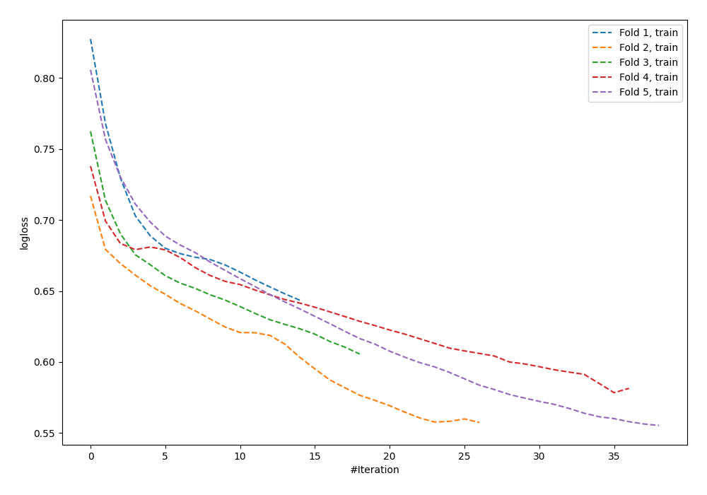

# Summary of 96_NeuralNetwork_SelectedFeatures

[<< Go back](../README.md)

## Neural Network
- **n_jobs**: -1
- **dense_1_size**: 16
- **dense_2_size**: 8
- **learning_rate**: 0.01
- **explain_level**: 0

## Validation
 - **validation_type**: kfold
 - **shuffle**: True
 - **stratify**: True
 - **k_folds**: 5

## Optimized metric
logloss

## Training time

1.2 seconds

## Metric details
|           |    score |    threshold |
|:----------|---------:|-------------:|
| logloss   | 0.678305 | nan          |
| auc       | 0.609661 | nan          |
| f1        | 0.635697 |   0.275374   |
| accuracy  | 0.600639 |   0.527755   |
| precision | 0.611111 |   0.614188   |
| recall    | 1        |   0.00114754 |
| mcc       | 0.182306 |   0.363457   |

## Confusion matrix (at threshold=0.527755)
|                     |   Predicted as negative |   Predicted as positive |
|:--------------------|------------------------:|------------------------:|
| Labeled as negative |                     137 |                      36 |
| Labeled as positive |                      89 |                      51 |

## Learning curves

[<< Go back](../README.md)
