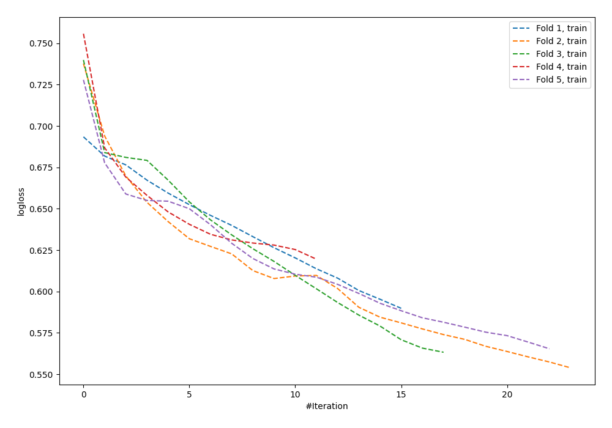

# Summary of 97_NeuralNetwork_SelectedFeatures

[<< Go back](../README.md)

## Neural Network
- **n_jobs**: -1
- **dense_1_size**: 16
- **dense_2_size**: 32
- **learning_rate**: 0.01
- **explain_level**: 0

## Validation
 - **validation_type**: kfold
 - **shuffle**: True
 - **stratify**: True
 - **k_folds**: 5

## Optimized metric
logloss

## Training time

1.2 seconds

## Metric details
|           |    score |   threshold |
|:----------|---------:|------------:|
| logloss   | 0.679187 |  nan        |
| auc       | 0.586664 |  nan        |
| f1        | 0.630137 |    0.210514 |
| accuracy  | 0.597444 |    0.495275 |
| precision | 0.6      |    0.599854 |
| recall    | 1        |    0.01046  |
| mcc       | 0.172258 |    0.495275 |

## Confusion matrix (at threshold=0.495275)
|                     |   Predicted as negative |   Predicted as positive |
|:--------------------|------------------------:|------------------------:|
| Labeled as negative |                     125 |                      48 |
| Labeled as positive |                      78 |                      62 |

## Learning curves

[<< Go back](../README.md)
