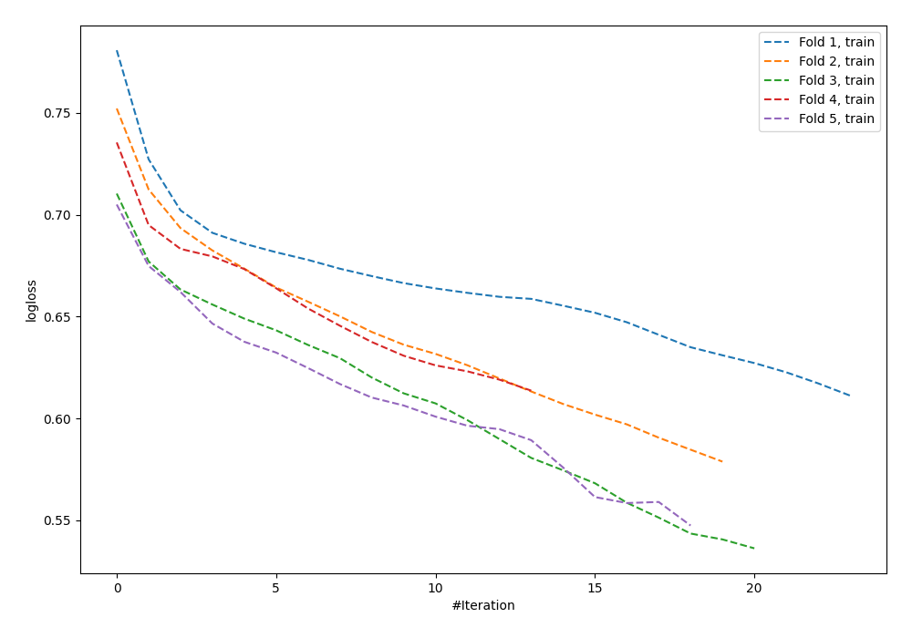

# Summary of 98_NeuralNetwork

[<< Go back](../README.md)

## Neural Network
- **n_jobs**: -1
- **dense_1_size**: 16
- **dense_2_size**: 8
- **learning_rate**: 0.01
- **explain_level**: 0

## Validation
 - **validation_type**: kfold
 - **shuffle**: True
 - **stratify**: True
 - **k_folds**: 5

## Optimized metric
logloss

## Training time

1.2 seconds

## Metric details
|           |    score |   threshold |
|:----------|---------:|------------:|
| logloss   | 0.685355 | nan         |
| auc       | 0.585343 | nan         |
| f1        | 0.620525 |   0.263549  |
| accuracy  | 0.603834 |   0.510666  |
| precision | 0.65     |   0.558256  |
| recall    | 1        |   0.0576504 |
| mcc       | 0.180511 |   0.52633   |

## Confusion matrix (at threshold=0.510666)
|                     |   Predicted as negative |   Predicted as positive |
|:--------------------|------------------------:|------------------------:|
| Labeled as negative |                     139 |                      34 |
| Labeled as positive |                      90 |                      50 |

## Learning curves

[<< Go back](../README.md)
