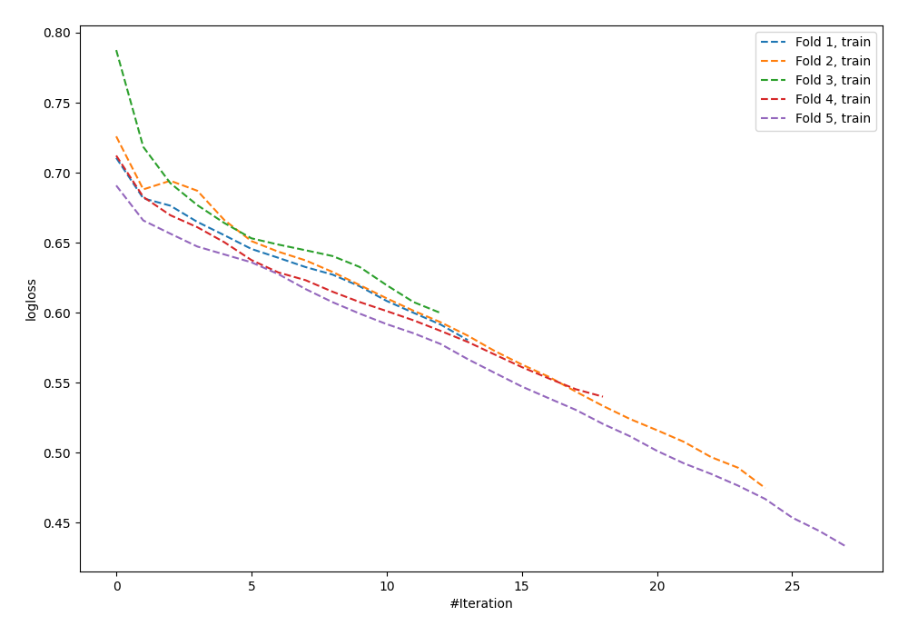

# Summary of 99_NeuralNetwork

[<< Go back](../README.md)

## Neural Network
- **n_jobs**: -1
- **dense_1_size**: 16
- **dense_2_size**: 32
- **learning_rate**: 0.01
- **explain_level**: 0

## Validation
 - **validation_type**: kfold
 - **shuffle**: True
 - **stratify**: True
 - **k_folds**: 5

## Optimized metric
logloss

## Training time

1.2 seconds

## Metric details
|           |    score |   threshold |
|:----------|---------:|------------:|
| logloss   | 0.701244 | nan         |
| auc       | 0.560941 | nan         |
| f1        | 0.632794 |   0.256946  |
| accuracy  | 0.57508  |   0.512166  |
| precision | 0.546667 |   0.512166  |
| recall    | 1        |   0.0176289 |
| mcc       | 0.156211 |   0.256946  |

## Confusion matrix (at threshold=0.512166)
|                     |   Predicted as negative |   Predicted as positive |
|:--------------------|------------------------:|------------------------:|
| Labeled as negative |                     139 |                      34 |
| Labeled as positive |                      99 |                      41 |

## Learning curves

[<< Go back](../README.md)
