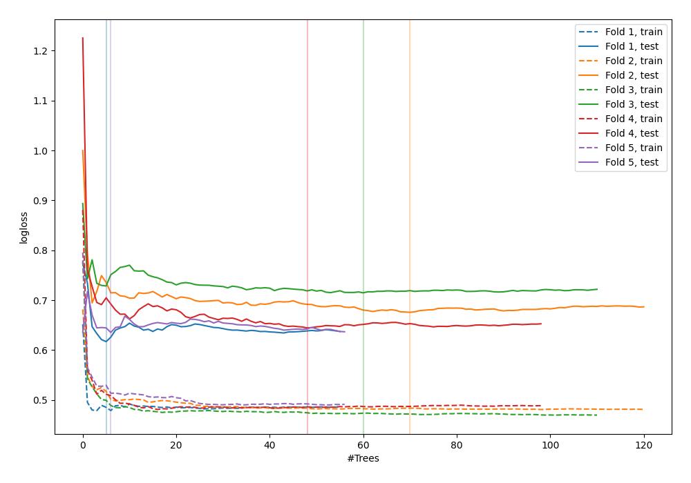

# Summary of 9_Default_RandomForest

[<< Go back](../README.md)

## Random Forest
- **n_jobs**: -1
- **criterion**: gini
- **max_features**: 0.9
- **min_samples_split**: 30
- **max_depth**: 4
- **explain_level**: 0

## Validation
 - **validation_type**: kfold
 - **shuffle**: True
 - **stratify**: True
 - **k_folds**: 5

## Optimized metric
logloss

## Training time

4.5 seconds

## Metric details
|           |    score |   threshold |
|:----------|---------:|------------:|
| logloss   | 0.657582 | nan         |
| auc       | 0.642568 | nan         |
| f1        | 0.64631  |   0.264398  |
| accuracy  | 0.616613 |   0.49762   |
| precision | 0.625    |   0.67786   |
| recall    | 1        |   0.0528864 |
| mcc       | 0.247431 |   0.346529  |

## Confusion matrix (at threshold=0.49762)
|                     |   Predicted as negative |   Predicted as positive |
|:--------------------|------------------------:|------------------------:|
| Labeled as negative |                     110 |                      63 |
| Labeled as positive |                      57 |                      83 |

## Learning curves

[<< Go back](../README.md)
