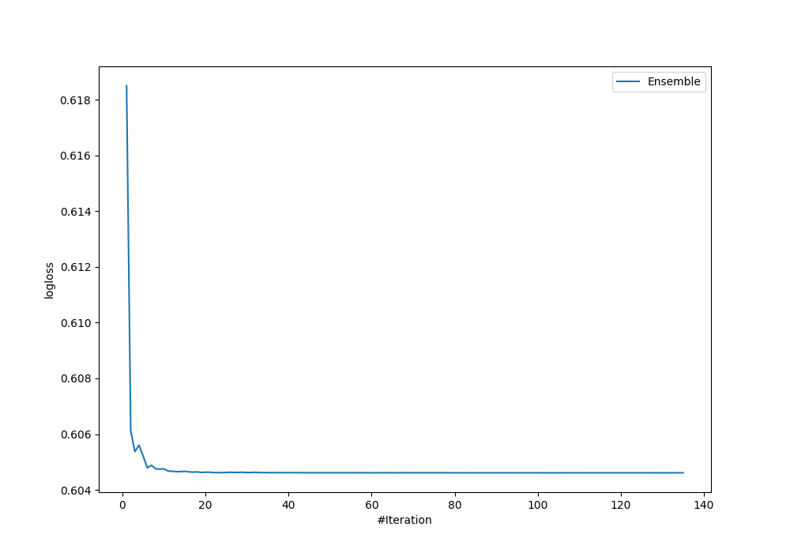

# Summary of Ensemble

[<< Go back](../README.md)

## Ensemble structure
| Model                                           |   Weight |
|:------------------------------------------------|---------:|
| 108_Xgboost_SelectedFeatures                    |       22 |
| 120_ExtraTrees_SelectedFeatures                 |        6 |
| 43_RandomForest_GoldenFeatures                  |       11 |
| 76_RandomForest_GoldenFeatures_SelectedFeatures |       43 |
| 81_RandomForest                                 |       47 |

## Metric details
|           |    score |   threshold |
|:----------|---------:|------------:|
| logloss   | 0.604612 |  nan        |
| auc       | 0.733113 |  nan        |
| f1        | 0.690691 |    0.415353 |
| accuracy  | 0.674121 |    0.533432 |
| precision | 0.818182 |    0.668661 |
| recall    | 1        |    0.106554 |
| mcc       | 0.378947 |    0.415353 |

## Confusion matrix (at threshold=0.533432)
|                     |   Predicted as negative |   Predicted as positive |
|:--------------------|------------------------:|------------------------:|
| Labeled as negative |                     136 |                      37 |
| Labeled as positive |                      65 |                      75 |

## Learning curves

[<< Go back](../README.md)
