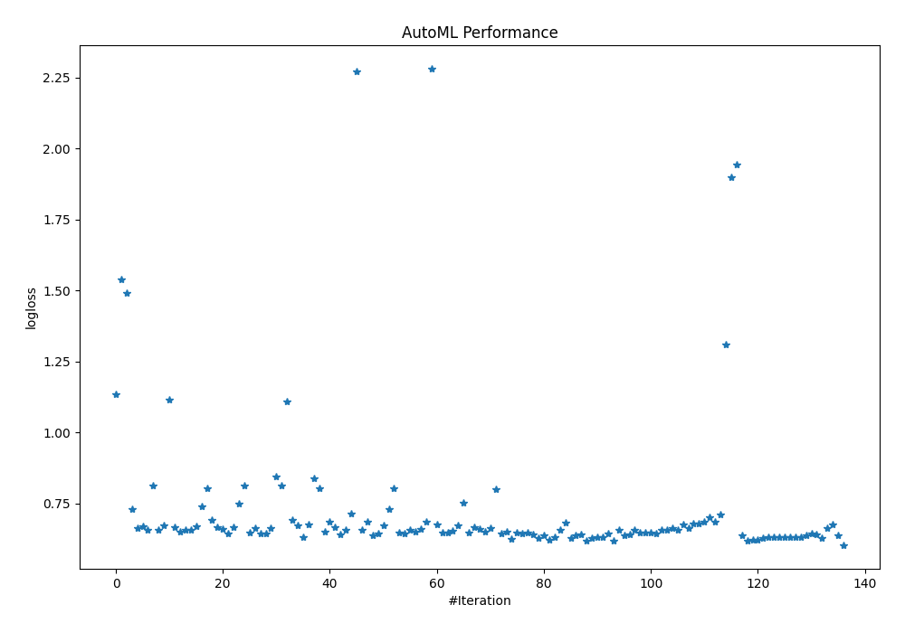
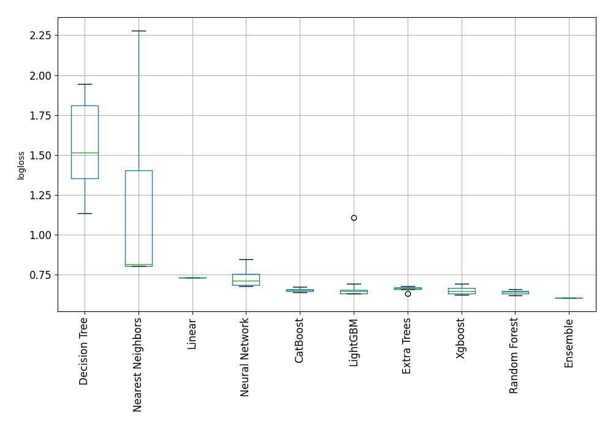

# AutoML Leaderboard

| Best model   | name                                                                                                           | model_type        | metric_type   |   metric_value |   train_time |
|:-------------|:---------------------------------------------------------------------------------------------------------------|:------------------|:--------------|---------------:|-------------:|
|              | [1_DecisionTree](1_DecisionTree/README.md)                                                                     | Decision Tree     | logloss       |       1.13475  |         1.06 |
|              | [2_DecisionTree](2_DecisionTree/README.md)                                                                     | Decision Tree     | logloss       |       1.53978  |         0.96 |
|              | [3_DecisionTree](3_DecisionTree/README.md)                                                                     | Decision Tree     | logloss       |       1.49058  |         0.95 |
|              | [4_Linear](4_Linear/README.md)                                                                                 | Linear            | logloss       |       0.729924 |         3.26 |
|              | [5_Default_LightGBM](5_Default_LightGBM/README.md)                                                             | LightGBM          | logloss       |       0.66263  |         1.46 |
|              | [6_Default_Xgboost](6_Default_Xgboost/README.md)                                                               | Xgboost           | logloss       |       0.669294 |         2.09 |
|              | [7_Default_CatBoost](7_Default_CatBoost/README.md)                                                             | CatBoost          | logloss       |       0.656896 |         3.28 |
|              | [8_Default_NeuralNetwork](8_Default_NeuralNetwork/README.md)                                                   | Neural Network    | logloss       |       0.814585 |         1.21 |
|              | [9_Default_RandomForest](9_Default_RandomForest/README.md)                                                     | Random Forest     | logloss       |       0.657582 |         4.76 |
|              | [10_Default_ExtraTrees](10_Default_ExtraTrees/README.md)                                                       | Extra Trees       | logloss       |       0.674884 |         5.72 |
|              | [11_Default_NearestNeighbors](11_Default_NearestNeighbors/README.md)                                           | Nearest Neighbors | logloss       |       1.11559  |         1.03 |
|              | [21_LightGBM](21_LightGBM/README.md)                                                                           | LightGBM          | logloss       |       0.666882 |         1.32 |
|              | [12_Xgboost](12_Xgboost/README.md)                                                                             | Xgboost           | logloss       |       0.65106  |         1.68 |
|              | [30_CatBoost](30_CatBoost/README.md)                                                                           | CatBoost          | logloss       |       0.659066 |         4.89 |
|              | [39_RandomForest](39_RandomForest/README.md)                                                                   | Random Forest     | logloss       |       0.656143 |         7.34 |
|              | [48_ExtraTrees](48_ExtraTrees/README.md)                                                                       | Extra Trees       | logloss       |       0.669831 |         3.82 |
|              | [57_NeuralNetwork](57_NeuralNetwork/README.md)                                                                 | Neural Network    | logloss       |       0.74109  |         1.14 |
|              | [66_NearestNeighbors](66_NearestNeighbors/README.md)                                                           | Nearest Neighbors | logloss       |       0.805013 |         1.05 |
|              | [22_LightGBM](22_LightGBM/README.md)                                                                           | LightGBM          | logloss       |       0.691714 |         1.22 |
|              | [13_Xgboost](13_Xgboost/README.md)                                                                             | Xgboost           | logloss       |       0.666074 |         1.99 |
|              | [31_CatBoost](31_CatBoost/README.md)                                                                           | CatBoost          | logloss       |       0.659949 |         5.25 |
|              | [40_RandomForest](40_RandomForest/README.md)                                                                   | Random Forest     | logloss       |       0.644122 |         3.99 |
|              | [49_ExtraTrees](49_ExtraTrees/README.md)                                                                       | Extra Trees       | logloss       |       0.665859 |         4.38 |
|              | [58_NeuralNetwork](58_NeuralNetwork/README.md)                                                                 | Neural Network    | logloss       |       0.748438 |         1.93 |
|              | [67_NearestNeighbors](67_NearestNeighbors/README.md)                                                           | Nearest Neighbors | logloss       |       0.813838 |         1.07 |
|              | [23_LightGBM](23_LightGBM/README.md)                                                                           | LightGBM          | logloss       |       0.647677 |         1.15 |
|              | [14_Xgboost](14_Xgboost/README.md)                                                                             | Xgboost           | logloss       |       0.664572 |         1.23 |
|              | [32_CatBoost](32_CatBoost/README.md)                                                                           | CatBoost          | logloss       |       0.645449 |         3.71 |
|              | [41_RandomForest](41_RandomForest/README.md)                                                                   | Random Forest     | logloss       |       0.645565 |         3.83 |
|              | [50_ExtraTrees](50_ExtraTrees/README.md)                                                                       | Extra Trees       | logloss       |       0.665443 |         4.16 |
|              | [59_NeuralNetwork](59_NeuralNetwork/README.md)                                                                 | Neural Network    | logloss       |       0.845317 |         1.79 |
|              | [68_NearestNeighbors](68_NearestNeighbors/README.md)                                                           | Nearest Neighbors | logloss       |       0.813838 |         1.02 |
|              | [24_LightGBM](24_LightGBM/README.md)                                                                           | LightGBM          | logloss       |       1.10859  |         1.38 |
|              | [15_Xgboost](15_Xgboost/README.md)                                                                             | Xgboost           | logloss       |       0.691451 |         9.05 |
|              | [33_CatBoost](33_CatBoost/README.md)                                                                           | CatBoost          | logloss       |       0.672918 |         5.24 |
|              | [42_RandomForest](42_RandomForest/README.md)                                                                   | Random Forest     | logloss       |       0.632654 |         6.27 |
|              | [51_ExtraTrees](51_ExtraTrees/README.md)                                                                       | Extra Trees       | logloss       |       0.676592 |         3.96 |
|              | [60_NeuralNetwork](60_NeuralNetwork/README.md)                                                                 | Neural Network    | logloss       |       0.838587 |         1.25 |
|              | [69_NearestNeighbors](69_NearestNeighbors/README.md)                                                           | Nearest Neighbors | logloss       |       0.805013 |         1.06 |
|              | [25_LightGBM](25_LightGBM/README.md)                                                                           | LightGBM          | logloss       |       0.650086 |         1.31 |
|              | [16_Xgboost](16_Xgboost/README.md)                                                                             | Xgboost           | logloss       |       0.687554 |         1.01 |
|              | [34_CatBoost](34_CatBoost/README.md)                                                                           | CatBoost          | logloss       |       0.667687 |         2.39 |
|              | [43_RandomForest](43_RandomForest/README.md)                                                                   | Random Forest     | logloss       |       0.640449 |         3.93 |
|              | [52_ExtraTrees](52_ExtraTrees/README.md)                                                                       | Extra Trees       | logloss       |       0.658366 |         3.41 |
|              | [61_NeuralNetwork](61_NeuralNetwork/README.md)                                                                 | Neural Network    | logloss       |       0.714594 |         1.85 |
|              | [70_NearestNeighbors](70_NearestNeighbors/README.md)                                                           | Nearest Neighbors | logloss       |       2.27279  |         1.04 |
|              | [26_LightGBM](26_LightGBM/README.md)                                                                           | LightGBM          | logloss       |       0.657782 |         1.22 |
|              | [17_Xgboost](17_Xgboost/README.md)                                                                             | Xgboost           | logloss       |       0.687554 |         0.9  |
|              | [35_CatBoost](35_CatBoost/README.md)                                                                           | CatBoost          | logloss       |       0.638586 |         1.75 |
|              | [44_RandomForest](44_RandomForest/README.md)                                                                   | Random Forest     | logloss       |       0.645247 |         5.04 |
|              | [53_ExtraTrees](53_ExtraTrees/README.md)                                                                       | Extra Trees       | logloss       |       0.672208 |         3.76 |
|              | [62_NeuralNetwork](62_NeuralNetwork/README.md)                                                                 | Neural Network    | logloss       |       0.730031 |         2.36 |
|              | [71_NearestNeighbors](71_NearestNeighbors/README.md)                                                           | Nearest Neighbors | logloss       |       0.805013 |         1.09 |
|              | [27_LightGBM](27_LightGBM/README.md)                                                                           | LightGBM          | logloss       |       0.6468   |         1.79 |
|              | [18_Xgboost](18_Xgboost/README.md)                                                                             | Xgboost           | logloss       |       0.643937 |         1.85 |
|              | [36_CatBoost](36_CatBoost/README.md)                                                                           | CatBoost          | logloss       |       0.657908 |         9.44 |
|              | [45_RandomForest](45_RandomForest/README.md)                                                                   | Random Forest     | logloss       |       0.651364 |         8.4  |
|              | [54_ExtraTrees](54_ExtraTrees/README.md)                                                                       | Extra Trees       | logloss       |       0.660601 |         6.01 |
|              | [63_NeuralNetwork](63_NeuralNetwork/README.md)                                                                 | Neural Network    | logloss       |       0.687424 |         1.43 |
|              | [72_NearestNeighbors](72_NearestNeighbors/README.md)                                                           | Nearest Neighbors | logloss       |       2.28034  |         1.28 |
|              | [28_LightGBM](28_LightGBM/README.md)                                                                           | LightGBM          | logloss       |       0.675103 |         1.67 |
|              | [19_Xgboost](19_Xgboost/README.md)                                                                             | Xgboost           | logloss       |       0.648309 |         1.88 |
|              | [37_CatBoost](37_CatBoost/README.md)                                                                           | CatBoost          | logloss       |       0.648463 |         3.89 |
|              | [46_RandomForest](46_RandomForest/README.md)                                                                   | Random Forest     | logloss       |       0.655615 |         6.69 |
|              | [55_ExtraTrees](55_ExtraTrees/README.md)                                                                       | Extra Trees       | logloss       |       0.672635 |         4.72 |
|              | [64_NeuralNetwork](64_NeuralNetwork/README.md)                                                                 | Neural Network    | logloss       |       0.753589 |         2.39 |
|              | [29_LightGBM](29_LightGBM/README.md)                                                                           | LightGBM          | logloss       |       0.647985 |         1.52 |
|              | [20_Xgboost](20_Xgboost/README.md)                                                                             | Xgboost           | logloss       |       0.668292 |         3.14 |
|              | [38_CatBoost](38_CatBoost/README.md)                                                                           | CatBoost          | logloss       |       0.660248 |         4.65 |
|              | [47_RandomForest](47_RandomForest/README.md)                                                                   | Random Forest     | logloss       |       0.651242 |         7.71 |
|              | [56_ExtraTrees](56_ExtraTrees/README.md)                                                                       | Extra Trees       | logloss       |       0.662461 |         4.19 |
|              | [65_NeuralNetwork](65_NeuralNetwork/README.md)                                                                 | Neural Network    | logloss       |       0.799786 |         1.43 |
|              | [42_RandomForest_GoldenFeatures](42_RandomForest_GoldenFeatures/README.md)                                     | Random Forest     | logloss       |       0.645942 |         8.07 |
|              | [35_CatBoost_GoldenFeatures](35_CatBoost_GoldenFeatures/README.md)                                             | CatBoost          | logloss       |       0.650375 |         2.34 |
|              | [43_RandomForest_GoldenFeatures](43_RandomForest_GoldenFeatures/README.md)                                     | Random Forest     | logloss       |       0.626333 |         4.22 |
|              | [42_RandomForest_KMeansFeatures](42_RandomForest_KMeansFeatures/README.md)                                     | Random Forest     | logloss       |       0.648354 |         8.63 |
|              | [35_CatBoost_KMeansFeatures](35_CatBoost_KMeansFeatures/README.md)                                             | CatBoost          | logloss       |       0.646337 |         3.38 |
|              | [43_RandomForest_KMeansFeatures](43_RandomForest_KMeansFeatures/README.md)                                     | Random Forest     | logloss       |       0.646849 |         7.5  |
|              | [43_RandomForest_GoldenFeatures_RandomFeature](43_RandomForest_GoldenFeatures_RandomFeature/README.md)         | Random Forest     | logloss       |       0.640199 |        30.46 |
|              | [43_RandomForest_GoldenFeatures_SelectedFeatures](43_RandomForest_GoldenFeatures_SelectedFeatures/README.md)   | Random Forest     | logloss       |       0.629132 |         6.31 |
|              | [35_CatBoost_SelectedFeatures](35_CatBoost_SelectedFeatures/README.md)                                         | CatBoost          | logloss       |       0.639841 |         1.98 |
|              | [18_Xgboost_SelectedFeatures](18_Xgboost_SelectedFeatures/README.md)                                           | Xgboost           | logloss       |       0.622468 |         1.82 |
|              | [27_LightGBM_SelectedFeatures](27_LightGBM_SelectedFeatures/README.md)                                         | LightGBM          | logloss       |       0.631101 |         1.47 |
|              | [52_ExtraTrees_SelectedFeatures](52_ExtraTrees_SelectedFeatures/README.md)                                     | Extra Trees       | logloss       |       0.657703 |         3.94 |
|              | [63_NeuralNetwork_SelectedFeatures](63_NeuralNetwork_SelectedFeatures/README.md)                               | Neural Network    | logloss       |       0.684493 |         1.5  |
|              | [73_Xgboost_SelectedFeatures](73_Xgboost_SelectedFeatures/README.md)                                           | Xgboost           | logloss       |       0.628289 |         2.64 |
|              | [74_RandomForest_GoldenFeatures](74_RandomForest_GoldenFeatures/README.md)                                     | Random Forest     | logloss       |       0.638509 |         5.65 |
|              | [75_RandomForest_GoldenFeatures](75_RandomForest_GoldenFeatures/README.md)                                     | Random Forest     | logloss       |       0.642252 |         4.59 |
|              | [76_RandomForest_GoldenFeatures_SelectedFeatures](76_RandomForest_GoldenFeatures_SelectedFeatures/README.md)   | Random Forest     | logloss       |       0.618965 |         5.26 |
|              | [77_RandomForest_GoldenFeatures_SelectedFeatures](77_RandomForest_GoldenFeatures_SelectedFeatures/README.md)   | Random Forest     | logloss       |       0.629132 |         6.52 |
|              | [78_LightGBM_SelectedFeatures](78_LightGBM_SelectedFeatures/README.md)                                         | LightGBM          | logloss       |       0.631101 |         1.48 |
|              | [79_LightGBM_SelectedFeatures](79_LightGBM_SelectedFeatures/README.md)                                         | LightGBM          | logloss       |       0.631101 |         1.45 |
|              | [80_RandomForest](80_RandomForest/README.md)                                                                   | Random Forest     | logloss       |       0.644287 |         7.17 |
|              | [81_RandomForest](81_RandomForest/README.md)                                                                   | Random Forest     | logloss       |       0.618504 |         5.97 |
|              | [82_CatBoost](82_CatBoost/README.md)                                                                           | CatBoost          | logloss       |       0.656109 |         2.6  |
|              | [83_CatBoost_SelectedFeatures](83_CatBoost_SelectedFeatures/README.md)                                         | CatBoost          | logloss       |       0.637168 |         2.12 |
|              | [84_Xgboost](84_Xgboost/README.md)                                                                             | Xgboost           | logloss       |       0.643081 |         2.1  |
|              | [85_CatBoost](85_CatBoost/README.md)                                                                           | CatBoost          | logloss       |       0.656896 |         3.7  |
|              | [86_LightGBM](86_LightGBM/README.md)                                                                           | LightGBM          | logloss       |       0.6468   |         1.71 |
|              | [87_LightGBM](87_LightGBM/README.md)                                                                           | LightGBM          | logloss       |       0.6468   |         2.17 |
|              | [88_LightGBM](88_LightGBM/README.md)                                                                           | LightGBM          | logloss       |       0.647677 |         1.61 |
|              | [89_Xgboost](89_Xgboost/README.md)                                                                             | Xgboost           | logloss       |       0.645741 |         1.92 |
|              | [90_ExtraTrees_SelectedFeatures](90_ExtraTrees_SelectedFeatures/README.md)                                     | Extra Trees       | logloss       |       0.658496 |         3.8  |
|              | [91_ExtraTrees_SelectedFeatures](91_ExtraTrees_SelectedFeatures/README.md)                                     | Extra Trees       | logloss       |       0.657703 |         3.98 |
|              | [92_ExtraTrees](92_ExtraTrees/README.md)                                                                       | Extra Trees       | logloss       |       0.665085 |         4.05 |
|              | [93_ExtraTrees](93_ExtraTrees/README.md)                                                                       | Extra Trees       | logloss       |       0.657874 |         3.8  |
|              | [94_ExtraTrees](94_ExtraTrees/README.md)                                                                       | Extra Trees       | logloss       |       0.675325 |         6.21 |
|              | [95_ExtraTrees](95_ExtraTrees/README.md)                                                                       | Extra Trees       | logloss       |       0.66334  |         5.01 |
|              | [96_NeuralNetwork_SelectedFeatures](96_NeuralNetwork_SelectedFeatures/README.md)                               | Neural Network    | logloss       |       0.678305 |         1.54 |
|              | [97_NeuralNetwork_SelectedFeatures](97_NeuralNetwork_SelectedFeatures/README.md)                               | Neural Network    | logloss       |       0.679187 |         1.51 |
|              | [98_NeuralNetwork](98_NeuralNetwork/README.md)                                                                 | Neural Network    | logloss       |       0.685355 |         1.51 |
|              | [99_NeuralNetwork](99_NeuralNetwork/README.md)                                                                 | Neural Network    | logloss       |       0.701244 |         1.51 |
|              | [100_NeuralNetwork](100_NeuralNetwork/README.md)                                                               | Neural Network    | logloss       |       0.685821 |         2.19 |
|              | [101_NeuralNetwork](101_NeuralNetwork/README.md)                                                               | Neural Network    | logloss       |       0.71289  |         2.41 |
|              | [102_DecisionTree](102_DecisionTree/README.md)                                                                 | Decision Tree     | logloss       |       1.30921  |         1.16 |
|              | [103_DecisionTree](103_DecisionTree/README.md)                                                                 | Decision Tree     | logloss       |       1.89919  |         0.54 |
|              | [104_DecisionTree](104_DecisionTree/README.md)                                                                 | Decision Tree     | logloss       |       1.94327  |         0.57 |
|              | [105_RandomForest](105_RandomForest/README.md)                                                                 | Random Forest     | logloss       |       0.63777  |         4.95 |
|              | [106_RandomForest_GoldenFeatures_SelectedFeatures](106_RandomForest_GoldenFeatures_SelectedFeatures/README.md) | Random Forest     | logloss       |       0.618965 |         5.54 |
|              | [107_Xgboost_SelectedFeatures](107_Xgboost_SelectedFeatures/README.md)                                         | Xgboost           | logloss       |       0.622907 |         1.72 |
|              | [108_Xgboost_SelectedFeatures](108_Xgboost_SelectedFeatures/README.md)                                         | Xgboost           | logloss       |       0.62401  |         1.69 |
|              | [109_Xgboost_SelectedFeatures](109_Xgboost_SelectedFeatures/README.md)                                         | Xgboost           | logloss       |       0.630512 |         1.78 |
|              | [110_Xgboost_SelectedFeatures](110_Xgboost_SelectedFeatures/README.md)                                         | Xgboost           | logloss       |       0.630735 |         1.51 |
|              | [111_LightGBM_SelectedFeatures](111_LightGBM_SelectedFeatures/README.md)                                       | LightGBM          | logloss       |       0.631101 |         1.46 |
|              | [112_LightGBM_SelectedFeatures](112_LightGBM_SelectedFeatures/README.md)                                       | LightGBM          | logloss       |       0.631101 |         1.46 |
|              | [113_LightGBM_SelectedFeatures](113_LightGBM_SelectedFeatures/README.md)                                       | LightGBM          | logloss       |       0.631101 |         1.5  |
|              | [114_LightGBM_SelectedFeatures](114_LightGBM_SelectedFeatures/README.md)                                       | LightGBM          | logloss       |       0.631101 |         1.45 |
|              | [115_LightGBM_SelectedFeatures](115_LightGBM_SelectedFeatures/README.md)                                       | LightGBM          | logloss       |       0.631101 |         1.58 |
|              | [116_LightGBM_SelectedFeatures](116_LightGBM_SelectedFeatures/README.md)                                       | LightGBM          | logloss       |       0.631101 |         1.6  |
|              | [117_CatBoost_SelectedFeatures](117_CatBoost_SelectedFeatures/README.md)                                       | CatBoost          | logloss       |       0.637605 |         2.02 |
|              | [118_Xgboost](118_Xgboost/README.md)                                                                           | Xgboost           | logloss       |       0.644637 |         1.94 |
|              | [119_Xgboost](119_Xgboost/README.md)                                                                           | Xgboost           | logloss       |       0.640396 |         1.79 |
|              | [120_ExtraTrees_SelectedFeatures](120_ExtraTrees_SelectedFeatures/README.md)                                   | Extra Trees       | logloss       |       0.629375 |         3.82 |
|              | [121_ExtraTrees](121_ExtraTrees/README.md)                                                                     | Extra Trees       | logloss       |       0.665503 |         5.52 |
|              | [122_NeuralNetwork_SelectedFeatures](122_NeuralNetwork_SelectedFeatures/README.md)                             | Neural Network    | logloss       |       0.676771 |         1.39 |
|              | [81_RandomForest_BoostOnErrors](81_RandomForest_BoostOnErrors/README.md)                                       | Random Forest     | logloss       |       0.63749  |         6.16 |
| **the best** | [Ensemble](Ensemble/README.md)                                                                                 | Ensemble          | logloss       |       0.604612 |        87.33 |

### AutoML Performance

### AutoML Performance Boxplot
