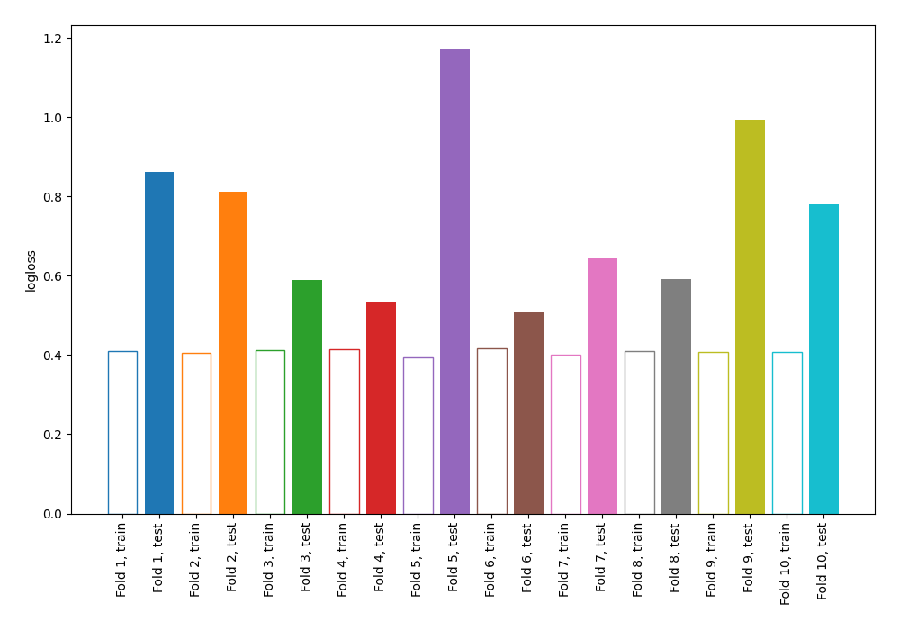

# Summary of 11_Default_NearestNeighbors

[<< Go back](../README.md)

## k-Nearest Neighbors (Nearest Neighbors)
- **n_jobs**: -1
- **n_neighbors**: 5
- **weights**: uniform
- **explain_level**: 0

## Validation
 - **validation_type**: kfold
 - **shuffle**: True
 - **stratify**: True
 - **k_folds**: 10

## Optimized metric
logloss

## Training time

1.0 seconds

## Metric details
|           |    score |   threshold |
|:----------|---------:|------------:|
| logloss   | 0.748981 |       nan   |
| auc       | 0.735546 |       nan   |
| f1        | 0.72117  |         0.2 |
| accuracy  | 0.665944 |         0.5 |
| precision | 0.810811 |         0.6 |
| recall    | 0.987288 |         0   |
| mcc       | 0.336727 |         0.6 |

## Confusion matrix (at threshold=0.5)
|                     |   Predicted as negative |   Predicted as positive |
|:--------------------|------------------------:|------------------------:|
| Labeled as negative |                     302 |                     148 |
| Labeled as positive |                     160 |                     312 |

## Learning curves

[<< Go back](../README.md)
