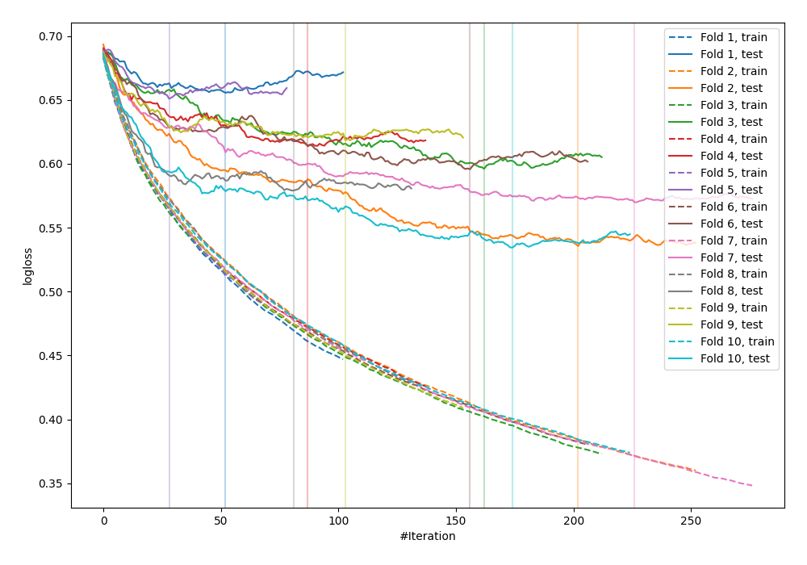

# Summary of 14_Xgboost

[<< Go back](../README.md)

## Extreme Gradient Boosting (Xgboost)
- **n_jobs**: -1
- **objective**: binary:logistic
- **eval_metric**: logloss
- **eta**: 0.1
- **max_depth**: 7
- **min_child_weight**: 25
- **subsample**: 0.9
- **colsample_bytree**: 0.6
- **explain_level**: 0

## Validation
 - **validation_type**: kfold
 - **shuffle**: True
 - **stratify**: True
 - **k_folds**: 10

## Optimized metric
logloss

## Training time

2.5 seconds

## Metric details
|           |    score |   threshold |
|:----------|---------:|------------:|
| logloss   | 0.594925 | nan         |
| auc       | 0.744379 | nan         |
| f1        | 0.732496 |   0.415178  |
| accuracy  | 0.683297 |   0.460052  |
| precision | 0.8      |   0.919486  |
| recall    | 1        |   0.0219221 |
| mcc       | 0.374371 |   0.415178  |

## Confusion matrix (at threshold=0.460052)
|                     |   Predicted as negative |   Predicted as positive |
|:--------------------|------------------------:|------------------------:|
| Labeled as negative |                     262 |                     188 |
| Labeled as positive |                     104 |                     368 |

## Learning curves

[<< Go back](../README.md)
