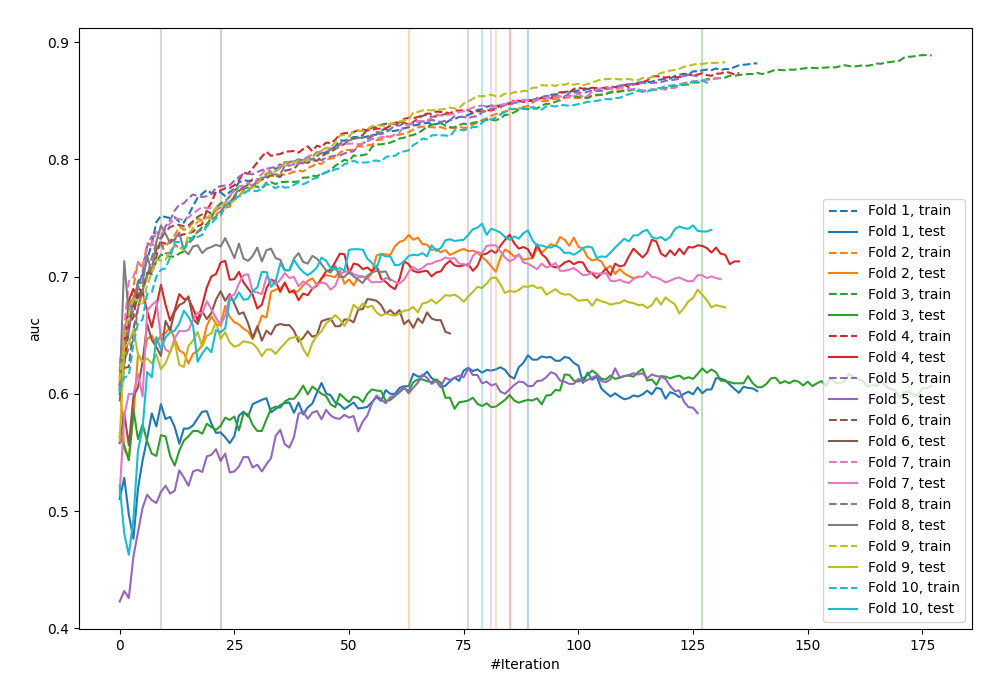

# Summary of 15_Xgboost

[<< Go back](../README.md)

## Extreme Gradient Boosting (Xgboost)
- **n_jobs**: -1
- **objective**: binary:logistic
- **eval_metric**: auc
- **eta**: 0.15
- **max_depth**: 8
- **min_child_weight**: 25
- **subsample**: 0.6
- **colsample_bytree**: 0.6
- **explain_level**: 0

## Validation
 - **validation_type**: kfold
 - **shuffle**: True
 - **stratify**: True
 - **k_folds**: 10

## Optimized metric
logloss

## Training time

43.1 seconds

## Metric details
|           |    score |   threshold |
|:----------|---------:|------------:|
| logloss   | 0.643865 | nan         |
| auc       | 0.683545 | nan         |
| f1        | 0.703704 |   0.38551   |
| accuracy  | 0.654013 |   0.489592  |
| precision | 0.71134  |   0.639817  |
| recall    | 1        |   0.0625473 |
| mcc       | 0.307492 |   0.489592  |

## Confusion matrix (at threshold=0.489592)
|                     |   Predicted as negative |   Predicted as positive |
|:--------------------|------------------------:|------------------------:|
| Labeled as negative |                     268 |                     182 |
| Labeled as positive |                     137 |                     335 |

## Learning curves

[<< Go back](../README.md)
