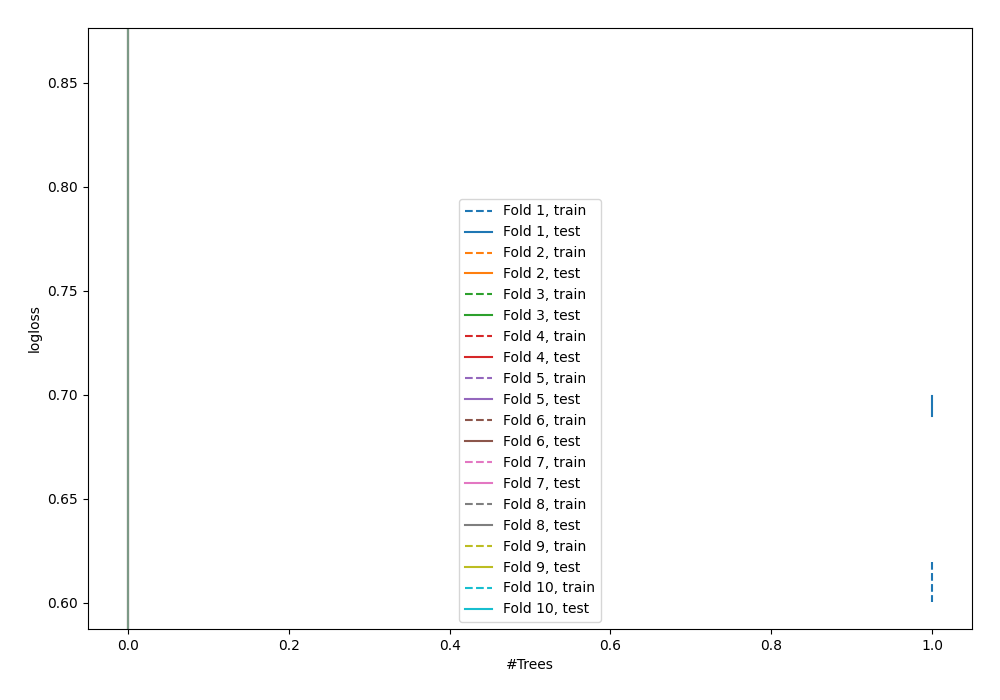

# Summary of 1_DecisionTree

[<< Go back](../README.md)

## Decision Tree
- **n_jobs**: -1
- **criterion**: gini
- **max_depth**: 3
- **explain_level**: 0

## Validation
 - **validation_type**: kfold
 - **shuffle**: True
 - **stratify**: True
 - **k_folds**: 10

## Optimized metric
logloss

## Training time

1.0 seconds

## Metric details
|           |    score |   threshold |
|:----------|---------:|------------:|
| logloss   | 0.74979  |  nan        |
| auc       | 0.576332 |  nan        |
| f1        | 0.677211 |    0        |
| accuracy  | 0.558568 |    0.424645 |
| precision | 0.818182 |    0.913043 |
| recall    | 0.997881 |    0        |
| mcc       | 0.124854 |    0.704861 |

## Confusion matrix (at threshold=0.424645)
|                     |   Predicted as negative |   Predicted as positive |
|:--------------------|------------------------:|------------------------:|
| Labeled as negative |                     212 |                     238 |
| Labeled as positive |                     169 |                     303 |

## Learning curves

[<< Go back](../README.md)
