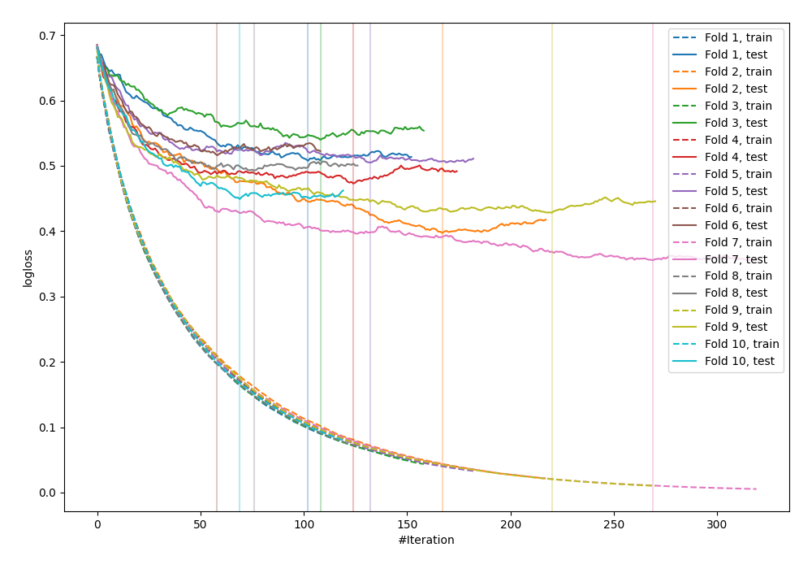

# Summary of 21_LightGBM

[<< Go back](../README.md)

## LightGBM
- **n_jobs**: -1
- **objective**: binary
- **metric**: binary_logloss
- **num_leaves**: 15
- **learning_rate**: 0.1
- **feature_fraction**: 0.8
- **bagging_fraction**: 0.8
- **min_data_in_leaf**: 10
- **explain_level**: 0

## Validation
 - **validation_type**: kfold
 - **shuffle**: True
 - **stratify**: True
 - **k_folds**: 10

## Optimized metric
logloss

## Training time

2.9 seconds

## Metric details
|           |    score |     threshold |
|:----------|---------:|--------------:|
| logloss   | 0.46641  | nan           |
| auc       | 0.859336 | nan           |
| f1        | 0.799616 |   0.375128    |
| accuracy  | 0.778742 |   0.490906    |
| precision | 0.983871 |   0.965859    |
| recall    | 1        |   0.000441462 |
| mcc       | 0.557193 |   0.375128    |

## Confusion matrix (at threshold=0.490906)
|                     |   Predicted as negative |   Predicted as positive |
|:--------------------|------------------------:|------------------------:|
| Labeled as negative |                     344 |                     106 |
| Labeled as positive |                      98 |                     374 |

## Learning curves

[<< Go back](../README.md)
