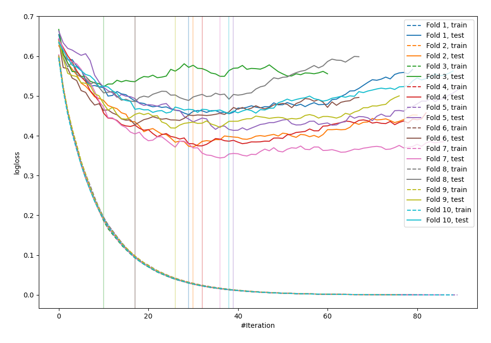

# Summary of 22_LightGBM

[<< Go back](../README.md)

## LightGBM
- **n_jobs**: -1
- **objective**: binary
- **metric**: binary_logloss
- **num_leaves**: 63
- **learning_rate**: 0.2
- **feature_fraction**: 0.5
- **bagging_fraction**: 1.0
- **min_data_in_leaf**: 10
- **explain_level**: 0

## Validation
 - **validation_type**: kfold
 - **shuffle**: True
 - **stratify**: True
 - **k_folds**: 10

## Optimized metric
logloss

## Training time

2.6 seconds

## Metric details
|           |    score |    threshold |
|:----------|---------:|-------------:|
| logloss   | 0.42689  | nan          |
| auc       | 0.883879 | nan          |
| f1        | 0.819639 |   0.443122   |
| accuracy  | 0.809111 |   0.581521   |
| precision | 1        |   0.985468   |
| recall    | 1        |   0.00188541 |
| mcc       | 0.619908 |   0.581521   |

## Confusion matrix (at threshold=0.581521)
|                     |   Predicted as negative |   Predicted as positive |
|:--------------------|------------------------:|------------------------:|
| Labeled as negative |                     377 |                      73 |
| Labeled as positive |                     103 |                     369 |

## Learning curves

[<< Go back](../README.md)
