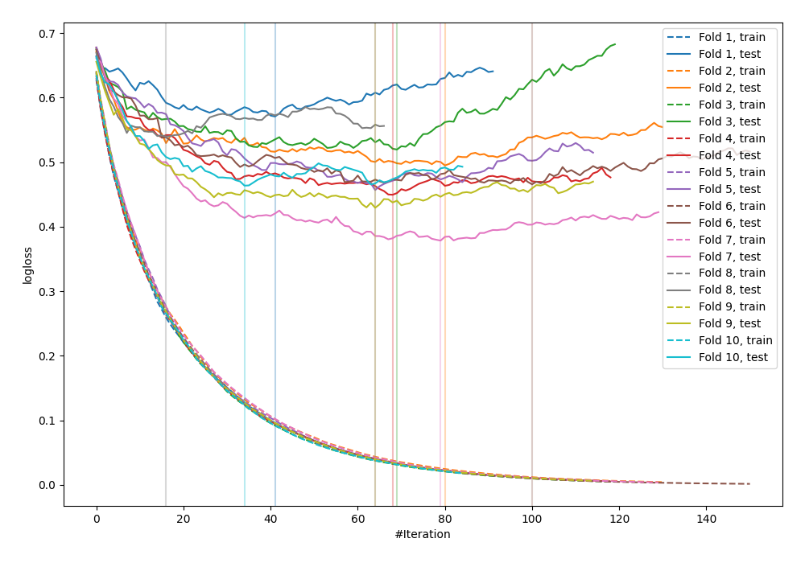

# Summary of 23_LightGBM

[<< Go back](../README.md)

## LightGBM
- **n_jobs**: -1
- **objective**: binary
- **metric**: binary_logloss
- **num_leaves**: 95
- **learning_rate**: 0.2
- **feature_fraction**: 0.9
- **bagging_fraction**: 1.0
- **min_data_in_leaf**: 30
- **explain_level**: 0

## Validation
 - **validation_type**: kfold
 - **shuffle**: True
 - **stratify**: True
 - **k_folds**: 10

## Optimized metric
logloss

## Training time

2.2 seconds

## Metric details
|           |    score |    threshold |
|:----------|---------:|-------------:|
| logloss   | 0.476956 | nan          |
| auc       | 0.858898 | nan          |
| f1        | 0.814885 |   0.384515   |
| accuracy  | 0.789588 |   0.384515   |
| precision | 1        |   0.997497   |
| recall    | 1        |   0.00028373 |
| mcc       | 0.592106 |   0.384515   |

## Confusion matrix (at threshold=0.384515)
|                     |   Predicted as negative |   Predicted as positive |
|:--------------------|------------------------:|------------------------:|
| Labeled as negative |                     301 |                     149 |
| Labeled as positive |                      45 |                     427 |

## Learning curves

[<< Go back](../README.md)
