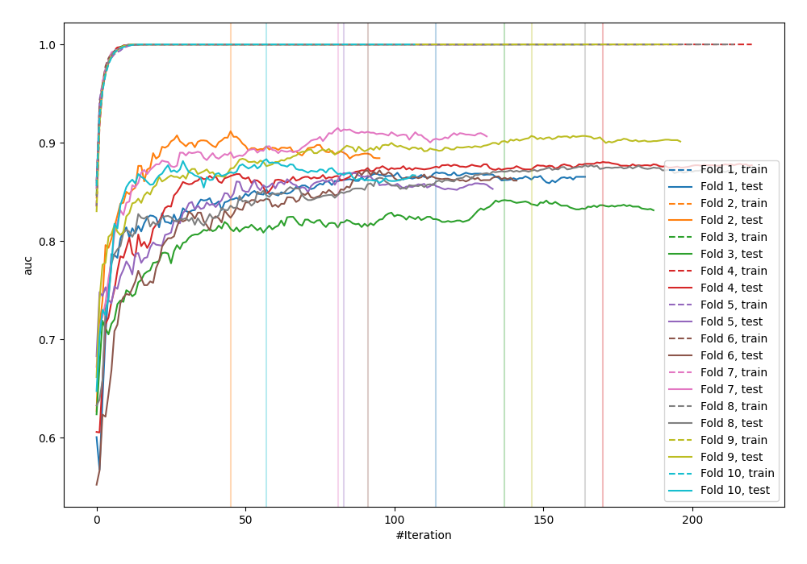

# Summary of 24_LightGBM

[<< Go back](../README.md)

## LightGBM
- **n_jobs**: -1
- **objective**: binary
- **metric**: auc
- **num_leaves**: 31
- **learning_rate**: 0.2
- **feature_fraction**: 0.5
- **bagging_fraction**: 0.8
- **min_data_in_leaf**: 10
- **explain_level**: 0

## Validation
 - **validation_type**: kfold
 - **shuffle**: True
 - **stratify**: True
 - **k_folds**: 10

## Optimized metric
logloss

## Training time

3.4 seconds

## Metric details
|           |    score |     threshold |
|:----------|---------:|--------------:|
| logloss   | 0.571743 | nan           |
| auc       | 0.871737 | nan           |
| f1        | 0.816901 |   0.352148    |
| accuracy  | 0.805857 |   0.491845    |
| precision | 0.944444 |   0.999533    |
| recall    | 1        |   1.62245e-07 |
| mcc       | 0.611446 |   0.491845    |

## Confusion matrix (at threshold=0.491845)
|                     |   Predicted as negative |   Predicted as positive |
|:--------------------|------------------------:|------------------------:|
| Labeled as negative |                     355 |                      95 |
| Labeled as positive |                      84 |                     388 |

## Learning curves

[<< Go back](../README.md)
