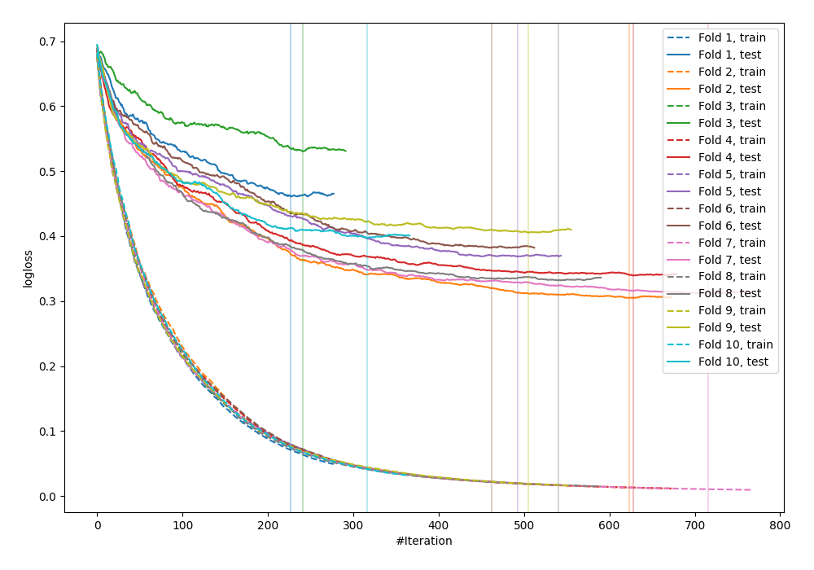

# Summary of 30_CatBoost

[<< Go back](../README.md)

## CatBoost
- **n_jobs**: -1
- **learning_rate**: 0.05
- **depth**: 8
- **rsm**: 0.8
- **loss_function**: Logloss
- **explain_level**: 0

## Validation
 - **validation_type**: kfold
 - **shuffle**: True
 - **stratify**: True
 - **k_folds**: 10

## Optimized metric
logloss

## Training time

49.0 seconds

## Metric details
|           |    score |    threshold |
|:----------|---------:|-------------:|
| logloss   | 0.38322  | nan          |
| auc       | 0.908437 | nan          |
| f1        | 0.831068 |   0.362891   |
| accuracy  | 0.827549 |   0.572881   |
| precision | 1        |   0.992874   |
| recall    | 1        |   0.00280183 |
| mcc       | 0.657172 |   0.572881   |

## Confusion matrix (at threshold=0.572881)
|                     |   Predicted as negative |   Predicted as positive |
|:--------------------|------------------------:|------------------------:|
| Labeled as negative |                     387 |                      63 |
| Labeled as positive |                      96 |                     376 |

## Learning curves

[<< Go back](../README.md)
