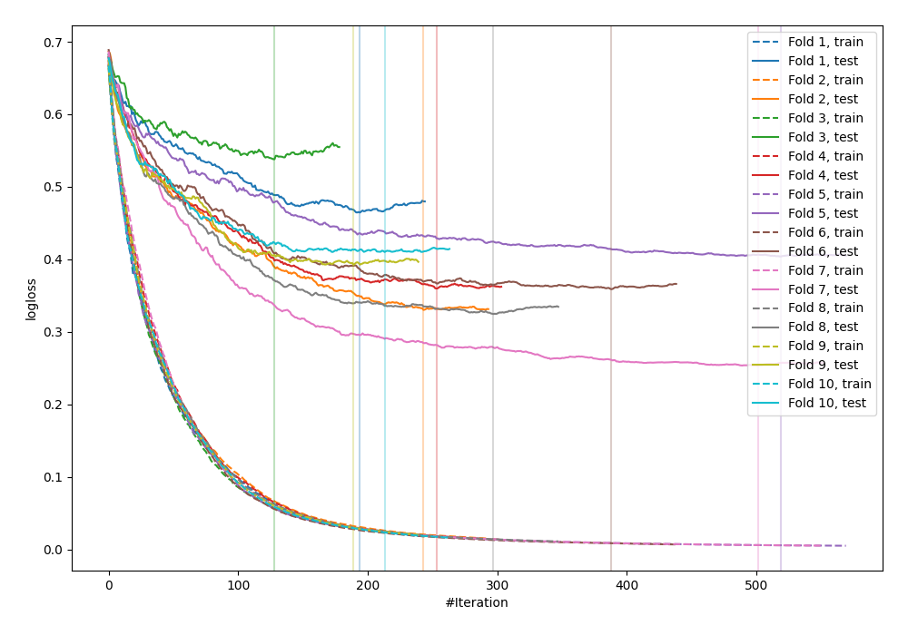

# Summary of 31_CatBoost

[<< Go back](../README.md)

## CatBoost
- **n_jobs**: -1
- **learning_rate**: 0.1
- **depth**: 8
- **rsm**: 1.0
- **loss_function**: Logloss
- **explain_level**: 0

## Validation
 - **validation_type**: kfold
 - **shuffle**: True
 - **stratify**: True
 - **k_folds**: 10

## Optimized metric
logloss

## Training time

40.6 seconds

## Metric details
|           |    score |    threshold |
|:----------|---------:|-------------:|
| logloss   | 0.383655 | nan          |
| auc       | 0.907943 | nan          |
| f1        | 0.839556 |   0.412287   |
| accuracy  | 0.830803 |   0.469347   |
| precision | 1        |   0.992109   |
| recall    | 1        |   0.00151002 |
| mcc       | 0.661892 |   0.463543   |

## Confusion matrix (at threshold=0.469347)
|                     |   Predicted as negative |   Predicted as positive |
|:--------------------|------------------------:|------------------------:|
| Labeled as negative |                     361 |                      89 |
| Labeled as positive |                      67 |                     405 |

## Learning curves

[<< Go back](../README.md)
