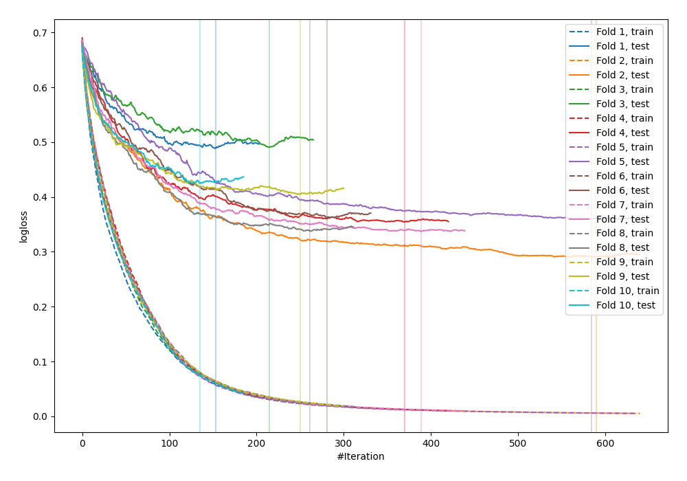

# Summary of 32_CatBoost

[<< Go back](../README.md)

## CatBoost
- **n_jobs**: -1
- **learning_rate**: 0.1
- **depth**: 7
- **rsm**: 1.0
- **loss_function**: Logloss
- **explain_level**: 0

## Validation
 - **validation_type**: kfold
 - **shuffle**: True
 - **stratify**: True
 - **k_folds**: 10

## Optimized metric
logloss

## Training time

24.6 seconds

## Metric details
|           |    score |    threshold |
|:----------|---------:|-------------:|
| logloss   | 0.385259 | nan          |
| auc       | 0.90783  | nan          |
| f1        | 0.84264  |   0.430024   |
| accuracy  | 0.834056 |   0.466383   |
| precision | 1        |   0.997728   |
| recall    | 1        |   0.00121015 |
| mcc       | 0.668166 |   0.466383   |

## Confusion matrix (at threshold=0.466383)
|                     |   Predicted as negative |   Predicted as positive |
|:--------------------|------------------------:|------------------------:|
| Labeled as negative |                     364 |                      86 |
| Labeled as positive |                      67 |                     405 |

## Learning curves

[<< Go back](../README.md)
