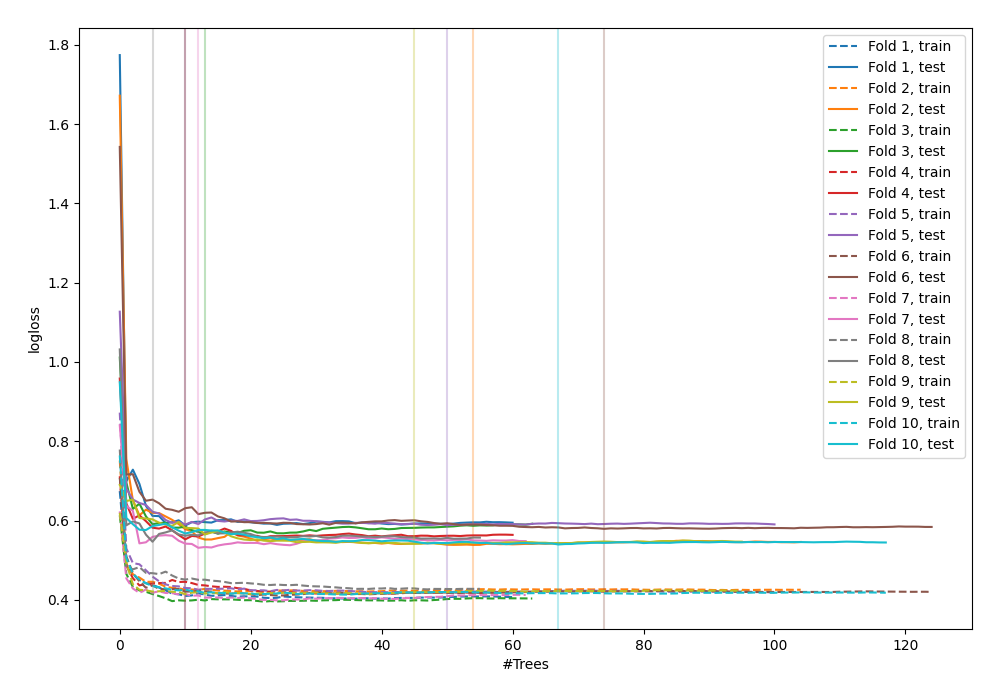

# Summary of 40_RandomForest

[<< Go back](../README.md)

## Random Forest
- **n_jobs**: -1
- **criterion**: gini
- **max_features**: 0.7
- **min_samples_split**: 30
- **max_depth**: 7
- **explain_level**: 0

## Validation
 - **validation_type**: kfold
 - **shuffle**: True
 - **stratify**: True
 - **k_folds**: 10

## Optimized metric
logloss

## Training time

9.3 seconds

## Metric details
|           |    score |   threshold |
|:----------|---------:|------------:|
| logloss   | 0.557022 | nan         |
| auc       | 0.811605 | nan         |
| f1        | 0.777882 |   0.445982  |
| accuracy  | 0.74295  |   0.445982  |
| precision | 1        |   0.810956  |
| recall    | 1        |   0.0301579 |
| mcc       | 0.500721 |   0.445982  |

## Confusion matrix (at threshold=0.445982)
|                     |   Predicted as negative |   Predicted as positive |
|:--------------------|------------------------:|------------------------:|
| Labeled as negative |                     270 |                     180 |
| Labeled as positive |                      57 |                     415 |

## Learning curves

[<< Go back](../README.md)
