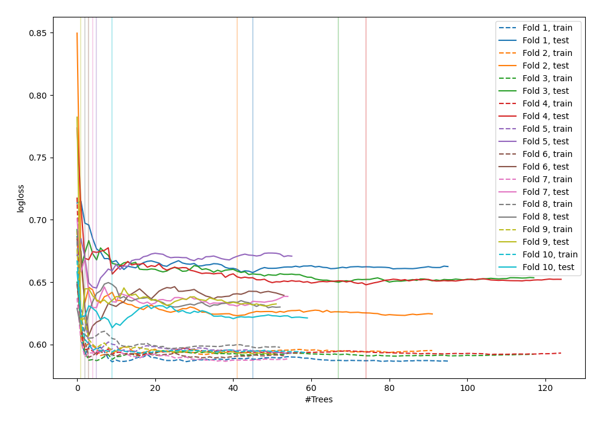

# Summary of 41_RandomForest

[<< Go back](../README.md)

## Random Forest
- **n_jobs**: -1
- **criterion**: gini
- **max_features**: 0.8
- **min_samples_split**: 40
- **max_depth**: 3
- **explain_level**: 0

## Validation
 - **validation_type**: kfold
 - **shuffle**: True
 - **stratify**: True
 - **k_folds**: 10

## Optimized metric
logloss

## Training time

7.4 seconds

## Metric details
|           |    score |   threshold |
|:----------|---------:|------------:|
| logloss   | 0.629578 |  nan        |
| auc       | 0.712465 |  nan        |
| f1        | 0.7109   |    0.396367 |
| accuracy  | 0.656182 |    0.491351 |
| precision | 1        |    0.839796 |
| recall    | 1        |    0.121076 |
| mcc       | 0.313202 |    0.491351 |

## Confusion matrix (at threshold=0.491351)
|                     |   Predicted as negative |   Predicted as positive |
|:--------------------|------------------------:|------------------------:|
| Labeled as negative |                     256 |                     194 |
| Labeled as positive |                     123 |                     349 |

## Learning curves

[<< Go back](../README.md)
