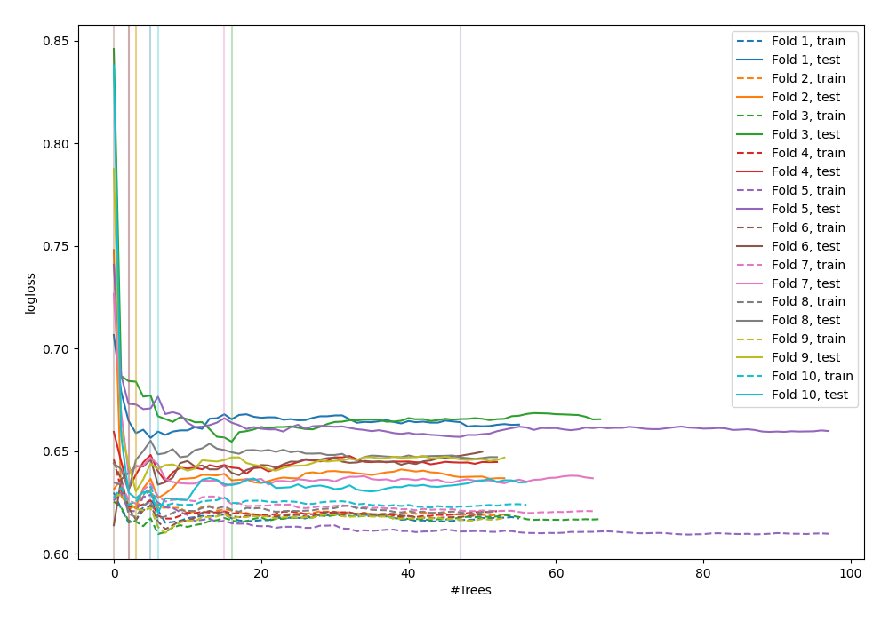

# Summary of 48_ExtraTrees

[<< Go back](../README.md)

## Extra Trees Classifier (Extra Trees)
- **n_jobs**: -1
- **criterion**: gini
- **max_features**: 0.5
- **min_samples_split**: 20
- **max_depth**: 4
- **explain_level**: 0

## Validation
 - **validation_type**: kfold
 - **shuffle**: True
 - **stratify**: True
 - **k_folds**: 10

## Optimized metric
logloss

## Training time

5.1 seconds

## Metric details
|           |    score |   threshold |
|:----------|---------:|------------:|
| logloss   | 0.635053 | nan         |
| auc       | 0.707575 | nan         |
| f1        | 0.713826 |   0.440502  |
| accuracy  | 0.644252 |   0.506335  |
| precision | 1        |   0.72472   |
| recall    | 1        |   0.0966667 |
| mcc       | 0.303934 |   0.530309  |

## Confusion matrix (at threshold=0.506335)
|                     |   Predicted as negative |   Predicted as positive |
|:--------------------|------------------------:|------------------------:|
| Labeled as negative |                     298 |                     152 |
| Labeled as positive |                     176 |                     296 |

## Learning curves

[<< Go back](../README.md)
