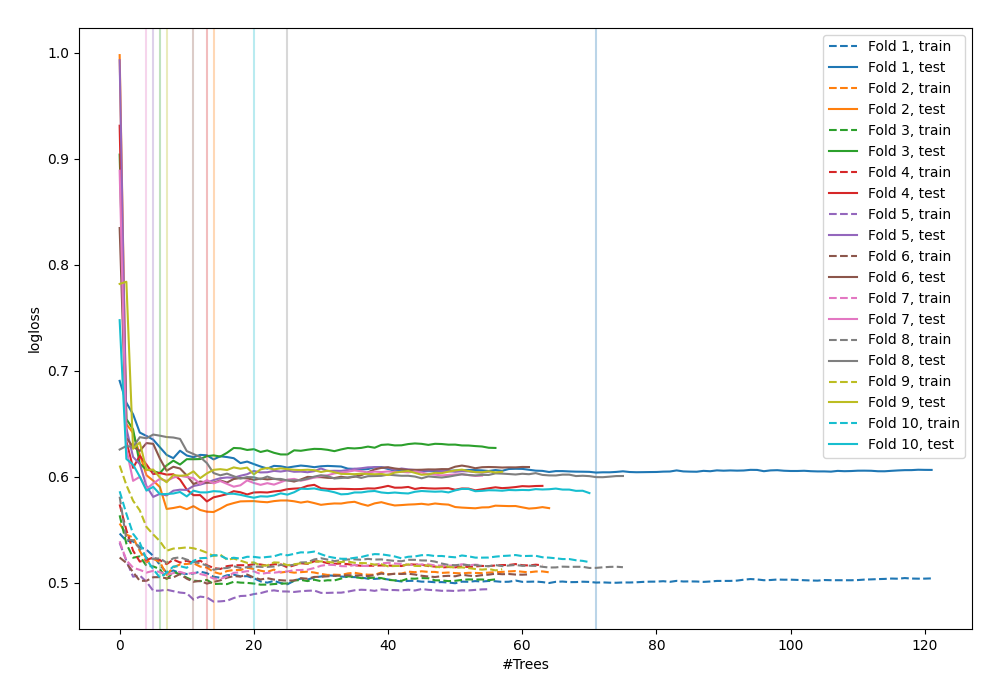

# Summary of 49_ExtraTrees

[<< Go back](../README.md)

## Extra Trees Classifier (Extra Trees)
- **n_jobs**: -1
- **criterion**: gini
- **max_features**: 0.7
- **min_samples_split**: 30
- **max_depth**: 7
- **explain_level**: 0

## Validation
 - **validation_type**: kfold
 - **shuffle**: True
 - **stratify**: True
 - **k_folds**: 10

## Optimized metric
logloss

## Training time

5.8 seconds

## Metric details
|           |    score |   threshold |
|:----------|---------:|------------:|
| logloss   | 0.588474 | nan         |
| auc       | 0.807255 | nan         |
| f1        | 0.772771 |   0.476504  |
| accuracy  | 0.75705  |   0.517171  |
| precision | 1        |   0.852118  |
| recall    | 1        |   0.0658301 |
| mcc       | 0.513943 |   0.517171  |

## Confusion matrix (at threshold=0.517171)
|                     |   Predicted as negative |   Predicted as positive |
|:--------------------|------------------------:|------------------------:|
| Labeled as negative |                     340 |                     110 |
| Labeled as positive |                     114 |                     358 |

## Learning curves

[<< Go back](../README.md)
